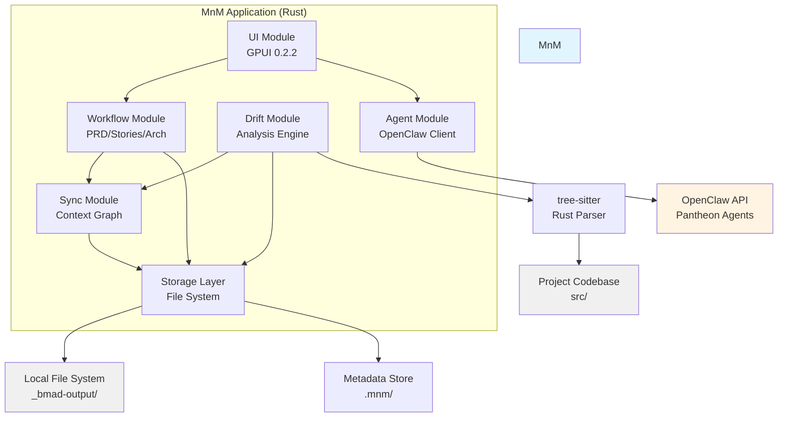
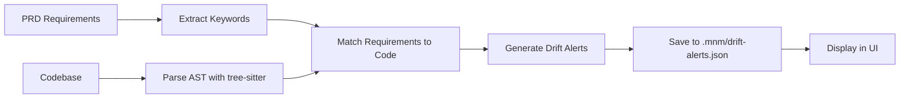
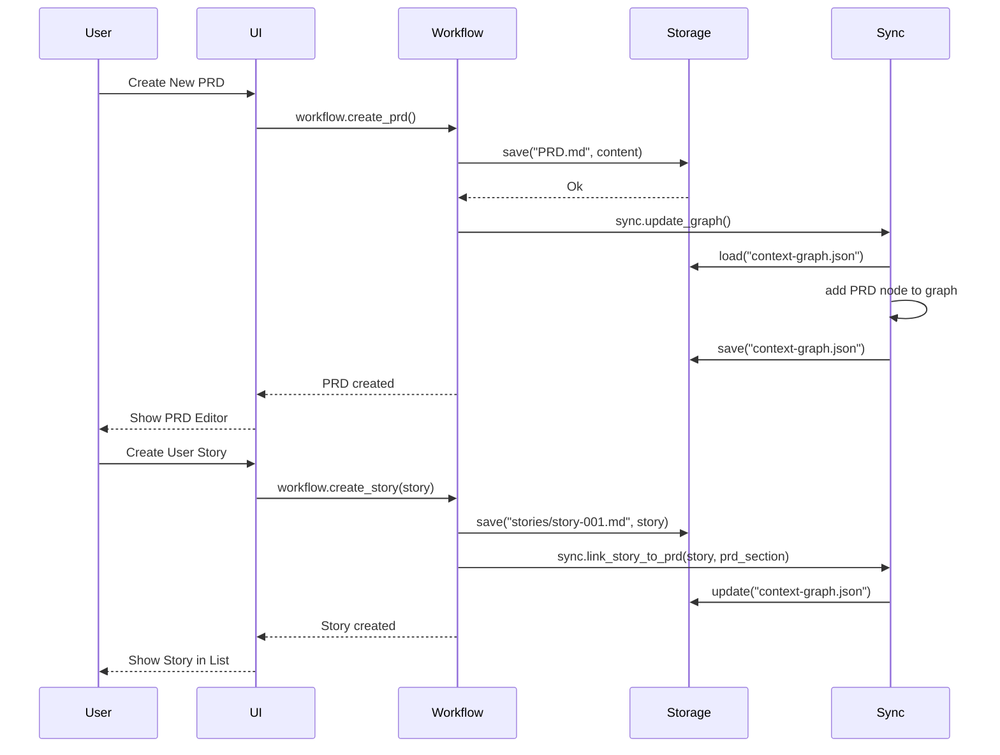
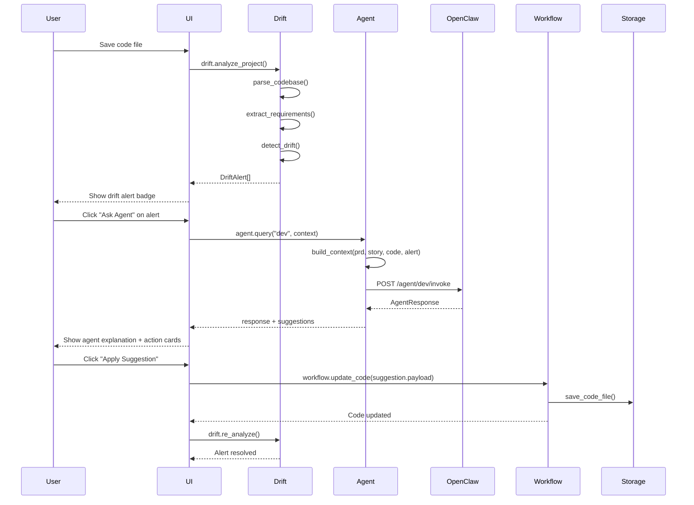

# Architecture Document - MnM MVP

**Author:** Pantheon (Daedalus - System Architect)  
**Date:** February 18, 2026  
**Product:** MnM - Product-First Agentic Development Environment  
**Version:** 1.0 - MVP Architecture  
**Status:** Ready for Implementation Review

---

## Executive Summary

This document defines the technical architecture for MnM MVP – a Rust-based desktop application using GPUI for UI, with local-first data storage and OpenClaw API integration for AI agents.

**Key Architectural Decisions:**
1. **Rust + GPUI:** Native performance, GPU-accelerated UI, type safety
2. **Local-First:** All data stored as Markdown files + JSON metadata (no cloud dependency)
3. **Modular Design:** Clean separation of UI, Workflow, Sync, Drift, Agent modules
4. **Agent Integration:** OpenClaw API via HTTP (stateless, each request includes full context)
5. **Tree-sitter Parsing:** Code analysis via battle-tested parsing library

---

## System Overview

### High-Level Architecture



### Data Flow

```
1. User creates PRD (Workflow Module)
   → PRD saved to _bmad-output/planning-artifacts/PRD.md (Storage Layer)
   → Context Graph updated (Sync Module)

2. User creates User Story (Workflow Module)
   → Story saved to _bmad-output/planning-artifacts/stories/story-001.md
   → Story linked to PRD section (Context Graph)

3. User writes code in src/
   → On file save, Drift Module triggers
   → tree-sitter parses Rust code
   → Drift engine compares code AST to PRD requirements
   → Drift alerts generated → saved to .mnm/drift-alerts.json

4. User clicks "Ask Agent" on drift alert
   → Agent Module builds context (PRD + Story + Code snippet + Alert)
   → HTTP request to OpenClaw API
   → Agent response rendered in UI
```

---

## Technology Stack

### Core Technologies

| Layer | Technology | Version | Rationale |
|-------|------------|---------|-----------|
| **Language** | Rust | 1.83+ | Memory safety, performance, GPUI compatibility |
| **UI Framework** | GPUI | 0.2.2 | GPU-accelerated, native feel, Rust-first |
| **Code Parsing** | tree-sitter | 0.20+ | Industry-standard, fast, incremental parsing |
| **HTTP Client** | reqwest | 0.11+ | Async HTTP for OpenClaw API calls |
| **Markdown Parsing** | pulldown-cmark | 0.9+ | Fast, CommonMark-compliant |
| **Serialization** | serde / serde_json | 1.0+ | JSON for metadata, YAML for config |
| **Async Runtime** | tokio | 1.35+ | Async file I/O, HTTP requests |
| **Testing** | cargo test + criterion | - | Unit tests + benchmarks |

### Development Tools

- **Build System:** Cargo (Rust native)
- **Linting:** Clippy (Rust linter)
- **Formatting:** rustfmt
- **Documentation:** rustdoc
- **Dependency Management:** Cargo.toml

### Platform Support (MVP)

- ✅ **macOS:** Primary development platform (Apple Silicon + Intel)
- ⏳ **Linux:** Post-MVP (GPUI supports Linux)
- ⏳ **Windows:** Post-MVP (GPUI supports Windows)

---

## Module Architecture

### Module 1: UI Module

**Responsibility:** Render user interface, handle user input, coordinate between modules.

**Technology:** GPUI 0.2.2 (Rust GPU-accelerated UI framework)

#### Components

1. **Dashboard View**
   - Displays workflow stages (PRD, Stories, Arch, Dev, Test, Deploy)
   - Shows drift alert summary
   - Quick action buttons

2. **Workflow Views**
   - **PRD Editor:** Markdown editor with live preview
   - **Stories List:** Table view of all stories, filterable
   - **Architecture Editor:** Markdown editor with Mermaid diagram support
   - **Dev Panel:** Code context sidebar

3. **Agent Panel**
   - Chat interface with agent selector
   - Message history
   - Suggestion cards (agent-recommended actions)

4. **Drift Alert Panel**
   - List of active drift alerts
   - Alert detail view (description, location, suggested fix)

#### Key Data Structures

```rust
// UI State (GPUI reactive state)
pub struct AppState {
    current_view: WorkflowStage, // PRD | Stories | Architecture | Dev | Test | Deploy
    active_story: Option<StoryId>,
    drift_alerts: Vec<DriftAlert>,
    agent_chat_history: Vec<ChatMessage>,
}

pub enum WorkflowStage {
    PRD,
    Stories,
    Architecture,
    Dev,
    Test,
    Deploy,
}
```

#### UI Architecture Patterns

- **GPUI Entity-Component System:** UI built as reactive components
- **Unidirectional Data Flow:** User actions → State updates → UI re-render
- **Keyboard-First:** All actions accessible via keyboard shortcuts

---

### Module 2: Workflow Module

**Responsibility:** Manage product lifecycle artifacts (PRD, Stories, Architecture).

#### Sub-Modules

1. **PRD Manager**
   - CRUD operations for PRD document
   - Markdown parsing and frontmatter extraction
   - PRD version history (future: Git integration)

2. **Story Manager**
   - Create, update, delete user stories
   - Link stories to PRD sections
   - Story status tracking (Todo, In Progress, Done)

3. **Architecture Manager**
   - Manage architecture.md document
   - ADR (Architecture Decision Record) templates
   - Mermaid diagram rendering

#### Key Data Structures

```rust
pub struct PRD {
    id: String,
    title: String,
    author: String,
    created_date: DateTime<Utc>,
    content: String, // Markdown
    sections: Vec<PRDSection>, // Parsed headings
}

pub struct PRDSection {
    id: String,
    heading: String, // e.g., "## User Authentication"
    level: u8, // 1-6 (heading depth)
    content: String,
    linked_stories: Vec<StoryId>,
}

pub struct UserStory {
    id: StoryId,
    title: String,
    as_a: String,
    i_want: String,
    so_that: String,
    acceptance_criteria: Vec<String>,
    status: StoryStatus,
    linked_prd_sections: Vec<String>, // PRDSection IDs
    linked_code_files: Vec<PathBuf>,
}

pub enum StoryStatus {
    Todo,
    InProgress,
    Done,
}
```

#### Persistence

- **PRD:** Saved to `_bmad-output/planning-artifacts/PRD.md`
- **Stories:** Each story saved to `_bmad-output/planning-artifacts/stories/story-{id}.md`
- **Architecture:** Saved to `_bmad-output/planning-artifacts/architecture.md`

All files use Markdown with YAML frontmatter:

```markdown
---
id: story-001
status: InProgress
linkedPRDSections: ["auth-requirements"]
linkedCodeFiles: ["src/auth/login.rs"]
---

# User Story: User Login

**As a** user  
**I want to** log in with email and password  
**So that** I can access my account

## Acceptance Criteria
- User can enter email and password
- Invalid credentials show error message
- Valid credentials redirect to dashboard
```

---

### Module 3: Sync Module (Context Synchronization)

**Responsibility:** Maintain bidirectional links between specs and code.

#### Core Functionality

1. **Context Graph Builder**
   - Parse all PRD sections, stories, and code files
   - Build graph: `Spec Node ←→ Code Node`
   - Detect changes (file modification timestamps)

2. **Link Suggester**
   - When story created, suggest related code files (keyword matching)
   - When code file created, suggest related stories

3. **Change Notifier**
   - Detect when linked spec updated → notify code files
   - Detect when linked code updated → notify specs

#### Context Graph Data Structure

```rust
pub struct ContextGraph {
    links: Vec<SpecCodeLink>,
    last_updated: DateTime<Utc>,
}

pub struct SpecCodeLink {
    spec_id: SpecIdentifier, // PRD section or Story ID
    code_files: Vec<PathBuf>,
    link_type: LinkType, // Auto-detected | Manual
    confidence: f32, // 0.0-1.0 (for auto-detected links)
    last_synced: DateTime<Utc>,
}

pub enum SpecIdentifier {
    PRDSection(String), // e.g., "## User Authentication"
    Story(StoryId),
}

pub enum LinkType {
    AutoDetected, // Suggested by keyword matching
    Manual,       // User-confirmed link
}
```

#### Persistence

- **Context Graph:** Saved to `.mnm/context-graph.json`
- **Format:** JSON (easy to inspect/debug)

Example:
```json
{
  "links": [
    {
      "spec_id": { "Story": "story-001" },
      "code_files": ["src/auth/login.rs", "src/auth/session.rs"],
      "link_type": "Manual",
      "confidence": 1.0,
      "last_synced": "2026-02-18T10:30:00Z"
    }
  ],
  "last_updated": "2026-02-18T10:30:00Z"
}
```

#### Sync Algorithm (Simplified)

```rust
fn sync_context_graph() {
    // 1. Load existing graph from .mnm/context-graph.json
    let mut graph = load_context_graph();
    
    // 2. Parse all PRD sections and stories
    let specs = parse_all_specs();
    
    // 3. Scan codebase for Rust files
    let code_files = scan_codebase();
    
    // 4. For each spec without links, suggest code files
    for spec in specs {
        if graph.get_links_for_spec(&spec.id).is_empty() {
            let suggestions = suggest_code_links(&spec, &code_files);
            // Store suggestions (user can confirm/reject in UI)
        }
    }
    
    // 5. Detect changes: compare file timestamps
    for link in graph.links.iter_mut() {
        let spec_modified = get_spec_modified_time(&link.spec_id);
        let code_modified = get_code_modified_time(&link.code_files);
        
        if spec_modified > link.last_synced {
            notify_code_updated(&link.code_files, "Spec changed");
        }
        if code_modified > link.last_synced {
            notify_spec_updated(&link.spec_id, "Code changed");
        }
    }
    
    // 6. Save updated graph
    save_context_graph(graph);
}
```

---

### Module 4: Drift Detection Module

**Responsibility:** Detect when code diverges from product specifications.

#### Drift Detection Pipeline



#### Drift Detection Algorithm (MVP - Rule-Based)

**Step 1: Extract Requirements from PRD**
```rust
fn extract_requirements(prd: &PRD) -> Vec<Requirement> {
    let mut requirements = Vec::new();
    
    for section in &prd.sections {
        // Parse bullet points as requirements
        for line in section.content.lines() {
            if line.trim().starts_with('-') || line.trim().starts_with('*') {
                let req = Requirement {
                    id: generate_id(),
                    text: line.trim().to_string(),
                    keywords: extract_keywords(line), // Simple: split, stem, filter stopwords
                    section_id: section.id.clone(),
                };
                requirements.push(req);
            }
        }
    }
    
    requirements
}

struct Requirement {
    id: String,
    text: String, // e.g., "User can edit profile"
    keywords: Vec<String>, // ["user", "edit", "profile"]
    section_id: String,
}
```

**Step 2: Parse Codebase**
```rust
use tree_sitter::{Parser, Language};

fn parse_codebase(project_root: &Path) -> CodeInventory {
    let mut parser = Parser::new();
    parser.set_language(tree_sitter_rust::language()).unwrap();
    
    let mut inventory = CodeInventory::new();
    
    // Scan all .rs files
    for file in find_rust_files(project_root) {
        let source = std::fs::read_to_string(&file).unwrap();
        let tree = parser.parse(&source, None).unwrap();
        
        // Extract public APIs, structs, functions
        for node in tree.root_node().children(&mut tree.walk()) {
            match node.kind() {
                "function_item" => {
                    let fn_name = extract_function_name(&node, &source);
                    inventory.functions.push(FunctionDef {
                        name: fn_name,
                        file: file.clone(),
                        visibility: extract_visibility(&node),
                    });
                },
                "struct_item" => {
                    let struct_name = extract_struct_name(&node, &source);
                    inventory.structs.push(StructDef {
                        name: struct_name,
                        file: file.clone(),
                    });
                },
                _ => {}
            }
        }
    }
    
    inventory
}

struct CodeInventory {
    functions: Vec<FunctionDef>,
    structs: Vec<StructDef>,
    modules: Vec<ModuleDef>,
}
```

**Step 3: Match Requirements to Code**
```rust
fn detect_drift(requirements: &[Requirement], inventory: &CodeInventory) -> Vec<DriftAlert> {
    let mut alerts = Vec::new();
    
    for req in requirements {
        let matched = find_matching_code(&req, inventory);
        
        if matched.is_empty() {
            // Requirement exists but no matching code found
            alerts.push(DriftAlert {
                alert_type: DriftType::MissingFeature,
                severity: Severity::Critical,
                description: format!("Requirement '{}' has no matching implementation", req.text),
                requirement_id: Some(req.id.clone()),
                code_location: None,
            });
        }
    }
    
    // Reverse check: code not mentioned in requirements
    for func in &inventory.functions {
        if func.visibility == Visibility::Public && !is_mentioned_in_specs(&func.name, requirements) {
            alerts.push(DriftAlert {
                alert_type: DriftType::UndocumentedFeature,
                severity: Severity::Warning,
                description: format!("Public function '{}' not documented in PRD", func.name),
                requirement_id: None,
                code_location: Some(func.file.clone()),
            });
        }
    }
    
    alerts
}

fn find_matching_code(req: &Requirement, inventory: &CodeInventory) -> Vec<String> {
    let mut matches = Vec::new();
    
    // Simple keyword matching: if function name contains requirement keywords, it's a match
    for func in &inventory.functions {
        let func_name_lower = func.name.to_lowercase();
        let match_score = req.keywords.iter()
            .filter(|kw| func_name_lower.contains(kw.as_str()))
            .count();
        
        if match_score >= 2 { // At least 2 keywords match
            matches.push(func.name.clone());
        }
    }
    
    matches
}
```

#### Drift Alert Data Structure

```rust
pub struct DriftAlert {
    id: String,
    alert_type: DriftType,
    severity: Severity,
    description: String,
    requirement_id: Option<String>, // Link to PRD section or story
    code_location: Option<PathBuf>,
    created_at: DateTime<Utc>,
    status: AlertStatus,
}

pub enum DriftType {
    MissingFeature,      // Spec exists, code doesn't
    UndocumentedFeature, // Code exists, spec doesn't
    BehavioralDrift,     // (Future) Semantic mismatch detected by AI
}

pub enum Severity {
    Critical, // Blocks deployment
    Warning,  // Should review
    Info,     // FYI
}

pub enum AlertStatus {
    Active,
    Resolved,    // User fixed the drift
    Dismissed,   // User acknowledged (intentional)
}
```

#### Persistence

- **Drift Alerts:** Saved to `.mnm/drift-alerts.json`
- **Alert History:** Append-only log in `.mnm/drift-history.jsonl` (for analytics)

---

### Module 5: Agent Integration Module

**Responsibility:** Interface with OpenClaw API for Pantheon AI agents.

#### Agent Types (MVP)

| Agent | Role | Key Capabilities |
|-------|------|------------------|
| **Product Agent** | PRD Refinement | Suggest missing sections, prioritize features, critique product vision |
| **Architect Agent** | System Design | Recommend architecture patterns, generate ADRs, review tech choices |
| **Dev Agent** | Code Generation | Generate code from stories, refactor suggestions, code reviews |
| **QA Agent** | Test Generation | Create test cases from acceptance criteria, identify edge cases |
| **Scrum Agent** | Project Management | Sprint planning, progress reports, velocity tracking |

#### OpenClaw API Integration

**API Endpoint:** `https://api.olympus.tomandrieu.com/agent/{agent_id}/invoke`

**Authentication:** Bearer token in Authorization header

**Agent API Keys:**
```rust
const AGENT_KEYS: &[(&str, &str)] = &[
    ("product", "olympus_product_key_2026"),
    ("architect", "olympus_daedalus_architect_key_2026"),
    ("dev", "olympus_hephaestos_dev_key_2026"),
    ("qa", "olympus_hygieia_qa_key_2026"),
    ("scrum", "olympus_hermes_scrum_key_2026"),
];
```

#### Agent Context Builder

**Key Design Decision:** Each agent request includes full context (stateless API).

```rust
pub struct AgentContext {
    prd: Option<PRD>,
    stories: Vec<UserStory>,
    architecture: Option<String>, // architecture.md content
    current_file: Option<String>, // Code file being edited
    drift_alerts: Vec<DriftAlert>,
    user_query: String,
}

impl AgentContext {
    pub fn to_prompt(&self) -> String {
        let mut prompt = String::new();
        
        // Include PRD summary
        if let Some(prd) = &self.prd {
            prompt.push_str(&format!("## Product Context\n{}\n\n", prd.summary()));
        }
        
        // Include relevant stories
        if !self.stories.is_empty() {
            prompt.push_str("## User Stories\n");
            for story in &self.stories {
                prompt.push_str(&format!("- {}: {}\n", story.id, story.title));
            }
            prompt.push_str("\n");
        }
        
        // Include current code context
        if let Some(code) = &self.current_file {
            prompt.push_str(&format!("## Current Code\n```rust\n{}\n```\n\n", code));
        }
        
        // User query
        prompt.push_str(&format!("## User Question\n{}\n", self.user_query));
        
        prompt
    }
}
```

#### Agent Client Implementation

```rust
use reqwest::Client;
use serde::{Deserialize, Serialize};

pub struct AgentClient {
    http_client: Client,
    base_url: String,
}

#[derive(Serialize)]
struct AgentRequest {
    context: String,
    query: String,
}

#[derive(Deserialize)]
struct AgentResponse {
    response: String,
    suggestions: Vec<ActionSuggestion>,
}

#[derive(Deserialize)]
struct ActionSuggestion {
    action_type: String, // "update_prd" | "generate_code" | "create_test"
    description: String,
    payload: serde_json::Value,
}

impl AgentClient {
    pub async fn query_agent(&self, agent_id: &str, context: AgentContext) -> Result<AgentResponse, Error> {
        let api_key = self.get_api_key(agent_id)?;
        let url = format!("{}/agent/{}/invoke", self.base_url, agent_id);
        
        let request = AgentRequest {
            context: context.to_prompt(),
            query: context.user_query.clone(),
        };
        
        let response = self.http_client
            .post(&url)
            .header("Authorization", format!("Bearer {}", api_key))
            .json(&request)
            .send()
            .await?
            .json::<AgentResponse>()
            .await?;
        
        Ok(response)
    }
    
    fn get_api_key(&self, agent_id: &str) -> Result<String, Error> {
        AGENT_KEYS.iter()
            .find(|(id, _)| *id == agent_id)
            .map(|(_, key)| key.to_string())
            .ok_or_else(|| Error::UnknownAgent(agent_id.to_string()))
    }
}
```

#### Agent Response Handling

**Agent responses include:**
1. **Text Response:** Natural language explanation
2. **Action Suggestions:** Structured actions (e.g., "Update PRD", "Generate Code")

Example response:
```json
{
  "response": "Based on your PRD, I notice the 'User Authentication' section is missing acceptance criteria. I recommend adding:\n- User can reset password via email\n- Sessions expire after 24 hours",
  "suggestions": [
    {
      "action_type": "update_prd",
      "description": "Add acceptance criteria to User Authentication section",
      "payload": {
        "section": "User Authentication",
        "content": "- User can reset password via email\n- Sessions expire after 24 hours"
      }
    }
  ]
}
```

**UI Handling:**
- Display `response` in chat interface
- Render `suggestions` as action cards (user can click to apply)

---

## Data Flow Diagrams

### Flow 1: PRD Creation → Story Creation



### Flow 2: Drift Detection → Alert → Agent Assistance



---

## File System Layout

```
mnm/                                 # Project root
├── src/                             # Rust source code
│   ├── main.rs                      # App entry point
│   ├── ui/                          # UI Module
│   │   ├── mod.rs
│   │   ├── dashboard.rs             # Dashboard view
│   │   ├── workflow_views.rs        # PRD/Stories/Arch editors
│   │   ├── agent_panel.rs           # Agent chat UI
│   │   └── drift_panel.rs           # Drift alerts UI
│   ├── workflow/                    # Workflow Module
│   │   ├── mod.rs
│   │   ├── prd.rs                   # PRD manager
│   │   ├── story.rs                 # Story manager
│   │   └── architecture.rs          # Architecture manager
│   ├── sync/                        # Sync Module
│   │   ├── mod.rs
│   │   ├── context_graph.rs         # Context graph builder
│   │   └── link_suggester.rs        # Auto-link suggestions
│   ├── drift/                       # Drift Detection Module
│   │   ├── mod.rs
│   │   ├── analyzer.rs              # Drift detection engine
│   │   ├── parser.rs                # tree-sitter code parsing
│   │   └── matcher.rs               # Requirement-code matching
│   ├── agent/                       # Agent Integration Module
│   │   ├── mod.rs
│   │   ├── client.rs                # OpenClaw API client
│   │   └── context_builder.rs       # Agent context generation
│   └── storage/                     # Storage Layer
│       ├── mod.rs
│       ├── file_storage.rs          # Markdown file I/O
│       └── metadata.rs              # JSON metadata handling
│
├── _bmad/                           # BMAD configuration (installed)
│   ├── _config/
│   └── bmm/                         # BMad Method module
│
├── _bmad-output/                    # Generated artifacts
│   ├── planning-artifacts/
│   │   ├── PRD.md
│   │   ├── architecture.md
│   │   └── stories/
│   │       ├── story-001.md
│   │       └── story-002.md
│   └── implementation-artifacts/
│       └── tests/
│
├── .mnm/                            # MnM metadata (hidden)
│   ├── context-graph.json           # Spec-code links
│   ├── drift-alerts.json            # Active drift alerts
│   ├── drift-history.jsonl          # Alert history
│   └── app-state.json               # UI state (last view, etc.)
│
├── Cargo.toml                       # Rust dependencies
└── README.md
```

---

## Key Architectural Decisions (ADRs)

### ADR-001: Use GPUI for UI Framework

**Context:** Need native-feeling UI with good performance for code/doc viewing.

**Decision:** Use GPUI 0.2.2 instead of Electron or Tauri.

**Rationale:**
- ✅ **Performance:** GPU-accelerated rendering, instant startup
- ✅ **Rust-First:** Type-safe UI, no JS bridge overhead
- ✅ **Native Feel:** macOS-native behavior, platform integration
- ❌ **Maturity:** GPUI 0.2.2 less mature than Electron (fewer examples, evolving API)

**Consequences:**
- Steeper learning curve for GPUI
- Smaller ecosystem (fewer third-party components)
- Mitigation: Budget extra time for UI prototyping

**Status:** ✅ Accepted

---

### ADR-002: Local-First Data Storage

**Context:** Need to store PRDs, stories, code links.

**Decision:** Store all data as local Markdown files + JSON metadata (no database, no cloud).

**Rationale:**
- ✅ **Simplicity:** No backend infrastructure, easy to debug
- ✅ **Portability:** Users can read/edit files outside MnM (Markdown is universal)
- ✅ **Git-Friendly:** All files version-controllable
- ✅ **Privacy:** No cloud sync = no data privacy concerns
- ❌ **Collaboration:** No real-time multi-user (acceptable for MVP)

**Consequences:**
- Easy to implement, test, and deploy
- Post-MVP: Add optional cloud sync for collaboration

**Status:** ✅ Accepted

---

### ADR-003: Rule-Based Drift Detection (MVP)

**Context:** Need to detect spec-code misalignment. Could use AI (expensive, complex) or rules (simple, fast).

**Decision:** Use keyword-based rule matching for MVP. Upgrade to AI-powered semantic analysis post-MVP.

**Rationale:**
- ✅ **Speed:** No LLM latency, instant analysis
- ✅ **Cost:** No API costs per drift check
- ✅ **Predictability:** Users can understand why alert fired
- ❌ **Accuracy:** False positives (keyword mismatch), false negatives (semantic drift)

**Consequences:**
- MVP drift detection will have limitations (document in onboarding)
- Post-MVP: Use OpenClaw API to add semantic drift detection (LLM-powered)

**Status:** ✅ Accepted

---

### ADR-004: Stateless Agent API Integration

**Context:** Agents need context (PRD, stories, code). Could maintain server-side session or send full context per request.

**Decision:** Send full context with each agent API request (stateless).

**Rationale:**
- ✅ **Simplicity:** No session management, no state sync issues
- ✅ **Reliability:** Each request independent (retries easy)
- ❌ **Bandwidth:** Larger requests (PRD content repeated)
- ❌ **Latency:** Slight increase in request size → slower response

**Consequences:**
- Agent responses <3s even with full context (acceptable for MVP)
- Post-MVP: Add context caching on server side if latency becomes issue

**Status:** ✅ Accepted

---

### ADR-005: tree-sitter for Code Parsing

**Context:** Need to parse Rust code to extract functions, structs, modules.

**Decision:** Use tree-sitter (not regex or rustc's AST).

**Rationale:**
- ✅ **Battle-Tested:** Used by GitHub, Zed, Neovim
- ✅ **Incremental Parsing:** Fast updates on file change
- ✅ **Language-Agnostic:** Future: add JS/Python/Go support easily
- ❌ **Complexity:** More complex than regex (but way more accurate)

**Consequences:**
- Robust code analysis from day 1
- Easy to extend to multi-language support post-MVP

**Status:** ✅ Accepted

---

## Security & Privacy

### Data Security (MVP)

- **Local Storage Only:** All data stored on user's machine (no cloud sync)
- **No Telemetry:** Zero usage tracking, no analytics
- **API Keys:** OpenClaw API keys stored in system keychain (not plaintext)

### Agent API Security

- **HTTPS Only:** All OpenClaw API requests over TLS
- **Bearer Tokens:** API keys sent in Authorization header (never in URL)
- **Key Rotation:** Support for rotating agent API keys (config file update)

### Code Privacy

- **No Code Upload:** User code never sent to OpenClaw (only metadata: function names, struct names)
- **Contextual Code Snippets:** Only relevant code snippets sent to agents (user-triggered, not automatic)

---

## Performance Requirements

### Startup Performance

- **Cold Start:** <2 seconds (app launch → dashboard visible)
- **Warm Start:** <500ms (subsequent launches with cached state)

### Drift Analysis Performance

| Codebase Size | Analysis Time | Target |
|---------------|---------------|--------|
| <1k LOC | <1 second | ✅ Instant feedback |
| 1k-10k LOC | <10 seconds | ✅ Acceptable for MVP |
| 10k-100k LOC | <60 seconds | ⚠️ Post-MVP optimization |

**Optimization Strategy (if needed):**
- Incremental analysis (only re-analyze changed files)
- Background thread (non-blocking UI)
- Caching (parsed AST stored in `.mnm/cache/`)

### Agent Response Performance

- **Target:** <3 seconds (95th percentile)
- **Dependency:** OpenClaw API latency (out of our control)
- **Mitigation:** Show loading indicator, support streaming responses (future)

---

## Testing Strategy

### Unit Tests

- **Workflow Module:** PRD/Story CRUD operations
- **Sync Module:** Context graph building, link suggestions
- **Drift Module:** Requirement extraction, code matching, alert generation
- **Agent Module:** Context building, API request formatting

**Coverage Target:** >80% for core modules

### Integration Tests

- **End-to-End Workflows:**
  - Create PRD → Create Story → Link to PRD → Verify context graph
  - Write code → Run drift analysis → Generate alert → Dismiss alert
  - Query agent → Verify context includes PRD + code → Parse response

### Manual Testing

- **UI Testing:** GPUI components (automated testing limited in GPUI 0.2.2)
- **Agent Integration:** Test with live OpenClaw API (staging environment)

### Performance Benchmarks

- **Criterion.rs** for drift analysis benchmarks
- **Target:** Drift analysis <5s for 5k LOC Rust project

---

## Deployment & Distribution

### Packaging (MVP)

- **macOS:** `.dmg` installer (Rust compiled binary)
- **Distribution:** GitHub Releases (manual download)

### Installation

1. User downloads `mnm-v1.0.0-macos.dmg`
2. Drags MnM.app to Applications folder
3. Runs MnM, completes onboarding (API key setup)

### Configuration

- **First Run:** Onboarding wizard
  - Welcome screen
  - "Setup OpenClaw API Keys" (paste keys for agents)
  - "Create First PRD" tutorial

- **Config File:** `.mnm/config.yaml`
```yaml
agent_api_keys:
  product: "olympus_product_key_2026"
  architect: "olympus_daedalus_architect_key_2026"
  dev: "olympus_hephaestos_dev_key_2026"
  qa: "olympus_hygieia_qa_key_2026"
  scrum: "olympus_hermes_scrum_key_2026"

drift_analysis:
  auto_run_on_save: true
  debounce_ms: 2000

ui:
  theme: "dark" # dark | light
  editor_font_size: 14
```

---

## Future Architecture Enhancements (Post-MVP)

### 1. Real-Time Collaboration

- **WebRTC:** Peer-to-peer sync for multi-user editing
- **CRDT:** Conflict-free replicated data types for PRD/story editing
- **Tech:** Automerge or Yjs

### 2. Cloud Sync

- **Backend:** Simple sync server (Rust + PostgreSQL)
- **Encryption:** End-to-end encryption (user-owned keys)
- **Conflict Resolution:** Last-write-wins with manual merge UI

### 3. Advanced Drift Detection (AI-Powered)

- **Semantic Analysis:** Use OpenClaw API to detect semantic drift
  - Example: PRD says "User can edit profile" but code only allows name changes (not email/photo)
- **Code Flow Analysis:** Trace execution paths to verify acceptance criteria

### 4. Multi-Language Support

- **Extend tree-sitter:** Add JavaScript, Python, Go parsers
- **Language-Agnostic Drift:** Generalize drift detection (not Rust-specific)

### 5. Integrations

- **Version Control:** Deep Git integration (link commits to stories, auto-generate changelogs)
- **CI/CD:** Verify drift alerts in CI pipeline (block merge if critical drift)
- **Project Management:** Sync stories with Linear, Jira (bidirectional)

---

## Risks & Mitigations

### Risk 1: GPUI API Instability (Medium)

**Risk:** GPUI 0.2.2 API changes in future versions → code breaks.

**Mitigation:**
- Pin GPUI version in Cargo.toml (no auto-upgrades)
- Abstract UI layer (create `ui_framework` module → easier to swap frameworks)
- Community: Contribute to GPUI project (build relationships with maintainers)

### Risk 2: tree-sitter Parsing Accuracy (Low)

**Risk:** tree-sitter fails to parse valid Rust code → drift analysis incomplete.

**Mitigation:**
- tree-sitter is battle-tested (used by GitHub, VS Code, etc.)
- Fallback: If parsing fails, show warning but don't block app
- Error reporting: Log parse errors to `.mnm/logs/` for debugging

### Risk 3: OpenClaw API Availability (High)

**Risk:** OpenClaw API down → agents unavailable → app feels broken.

**Mitigation:**
- **Graceful Degradation:** App works without agents (all core features functional)
- **Retry Logic:** Auto-retry failed API requests (exponential backoff)
- **Offline Mode:** Show "Agents offline" message, allow user to continue work
- **Caching:** Cache recent agent responses (answer repeated questions offline)

---

## Appendix

### Dependencies (Cargo.toml)

```toml
[package]
name = "mnm"
version = "1.0.0"
edition = "2021"

[dependencies]
# UI Framework
gpui = "0.2.2"

# Async Runtime
tokio = { version = "1.35", features = ["full"] }

# HTTP Client
reqwest = { version = "0.11", features = ["json"] }

# Serialization
serde = { version = "1.0", features = ["derive"] }
serde_json = "1.0"
serde_yaml = "0.9"

# Markdown Parsing
pulldown-cmark = "0.9"

# Code Parsing
tree-sitter = "0.20"
tree-sitter-rust = "0.20"

# Date/Time
chrono = "0.4"

# Error Handling
anyhow = "1.0"
thiserror = "1.0"

# Logging
tracing = "0.1"
tracing-subscriber = "0.3"

[dev-dependencies]
# Testing
criterion = "0.5" # Benchmarks
```

### Glossary

- **GPUI:** GPU User Interface - Rust UI framework (used by Zed editor)
- **tree-sitter:** Incremental parsing library (language-agnostic)
- **AST:** Abstract Syntax Tree (code parsed into tree structure)
- **ADR:** Architecture Decision Record (documents key technical decisions)
- **CRDT:** Conflict-Free Replicated Data Type (for distributed collaboration)

---

**Document Status:** ✅ Complete  
**Next Steps:**  
1. Review with Hephaestos (Dev Agent) for implementation feasibility  
2. Create initial project scaffold (`cargo new mnm`)  
3. Implement Module 1 (UI Module) - Dashboard skeleton  
4. Implement Module 2 (Workflow Module) - PRD editor  

**Owner:** Pantheon (Daedalus - Architect)  
**Reviewers:** Hephaestos (Implementation), Hygieia (Testing Strategy)
