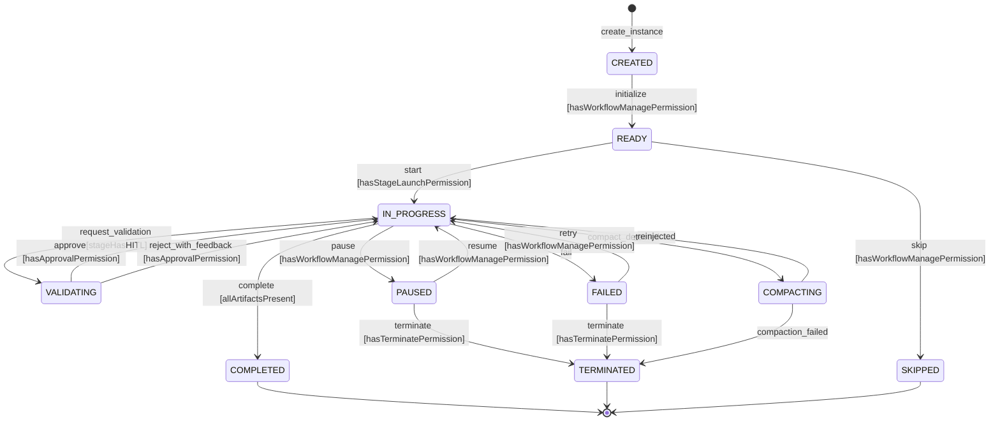

# ORCH-S01 : State Machine XState -- Orchestrateur Deterministe

## Metadonnees

| Champ | Valeur |
|-------|--------|
| **Story ID** | ORCH-S01 |
| **Titre** | State Machine XState v5 -- Cycle de vie deterministe des workflows |
| **Epic** | Epic ORCH -- Orchestrateur Deterministe (Noyau A) |
| **Sprint** | Sprint 3 (Batch 6) |
| **Effort** | L (8 SP, 5-7j) |
| **Priorite** | P0 -- Coeur de la value prop |
| **Assignation** | Cofondateur (backend + service) |
| **Bloque par** | RBAC-S01 (Fix hasPermission -- DONE) |
| **Debloque** | ORCH-S02 (WorkflowEnforcer), ORCH-S03 (Validation HITL), ORCH-S04 (API routes), DRIFT-S02 (Drift monitor), COMP-S01 (CompactionWatcher), DUAL-S03 (Enforcement curseur) |
| **ADR** | ADR-003 (Orchestrateur Deterministe -- State Machine) |
| **Type** | Backend (service + schema migration + API) |
| **FRs couverts** | REQ-ORCH-01, REQ-ORCH-04, REQ-ORCH-10 |

---

## Description

### Contexte -- Pourquoi cette story est critique

L'orchestrateur est le coeur de MnM. C'est lui qui impose que les agents IA executent EXACTEMENT ce qu'on leur dit -- des workflows deterministes, pas des suggestions. Sans lui, les agents sautent des etapes, ne chargent pas les bons fichiers, et derivent sans controle (Verite #45 CBA).

Aujourd'hui, le service `stages.ts` gere les transitions de stage_instances avec une simple map `VALID_TRANSITIONS` et un check `pending -> running -> review -> done`. C'est fonctionnel pour une V1, mais ca ne suffit pas pour l'enforcement B2B : pas de gardes RBAC sur les transitions, pas de persistance d'etat riche, pas d'evenements structures pour l'audit, pas de gestion des etats avances (compaction, validation humaine).

### Ce que cette story construit

1. **State machine XState v5** (`workflow-state-machine.ts`) -- machine formelle avec 7 etats, 12+ transitions, gardes RBAC
2. **Service orchestrateur** (`orchestrator.ts`) -- gere les instances de machines, persiste les etats dans PostgreSQL, emet des evenements
3. **Migration schema** -- enrichir `stage_instances` et `workflow_instances` avec les colonnes necessaires pour l'etat machine
4. **Integration** -- remplacer le systeme de transitions basique de `stages.ts` par la state machine XState
5. **Evenements structures** -- chaque transition emet un evenement type pour le systeme d'audit futur (OBS-S01/S02)

### Ce que cette story ne fait PAS (scope)

- Pas de verification de fichiers obligatoires (ORCH-S02)
- Pas de validation humaine HITL (ORCH-S03)
- Pas de nouvelles routes API orchestrateur (ORCH-S04)
- Pas de drift detection (DRIFT-S02)
- Pas de gestion de compaction (COMP-S01)
- Pas d'UI (backend-only)

---

## Etat Actuel du Code (Analyse)

### Fichiers existants impactes

| Fichier | Role actuel | Modification |
|---------|-------------|-------------|
| `server/src/services/stages.ts` | Service transitions basique (6 statuts, map VALID_TRANSITIONS) | MODIFIE : delegation a l'orchestrateur pour les transitions |
| `server/src/services/workflows.ts` | CRUD templates/instances + creation stages | MODIFIE : integration orchestrateur sur createInstance/updateInstance |
| `server/src/services/live-events.ts` | EventEmitter WebSocket unidirectionnel | UTILISE (pas modifie) : publish des evenements orchestrateur |
| `server/src/services/index.ts` | Barrel exports | MODIFIE : ajout exports orchestrateur |
| `packages/db/src/schema/stage_instances.ts` | Schema stage_instances (status text, artifacts jsonb) | MODIFIE : nouvelles colonnes |
| `packages/db/src/schema/workflow_instances.ts` | Schema workflow_instances (status text) | MODIFIE : nouvelles colonnes |
| `packages/db/src/schema/index.ts` | Barrel exports schemas | PAS MODIFIE (schemas deja exportes) |

### Fichiers a creer

| Fichier | Role |
|---------|------|
| `server/src/services/workflow-state-machine.ts` | Definition XState v5 de la state machine |
| `server/src/services/orchestrator.ts` | Service orchestrateur : gestion instances machines |
| `packages/shared/src/types/orchestrator.ts` | Types partages : etats, evenements, contexte |
| `packages/db/src/migrations/00XX_orch_s01_state_machine.sql` | Migration colonnes stage_instances + workflow_instances |
| `server/src/__tests__/orchestrator.test.ts` | Tests unitaires orchestrateur |
| `server/src/__tests__/workflow-state-machine.test.ts` | Tests unitaires state machine |

### Fichiers de reference (non modifies)

| Fichier | Role |
|---------|------|
| `server/src/services/access.ts` | `hasPermission()`, `canUser()` -- utilise pour les gardes RBAC |
| `packages/shared/src/constants.ts` | PERMISSION_KEYS, BUSINESS_ROLES |
| `packages/db/src/schema/workflow_templates.ts` | Schema templates (stages JSONB, acceptanceCriteria) |
| `packages/db/src/schema/heartbeat_runs.ts` | Schema heartbeat_runs (execution monitoring) |
| `server/src/services/heartbeat.ts` | HeartbeatService (integration future) |
| `server/src/errors.ts` | `conflict()`, `forbidden()`, `notFound()`, `unprocessable()` |
| `packages/test-utils/src/factories/` | Factories existantes |

### Conventions du codebase (a respecter)

1. **Service pattern** : `orchestratorService(db)` retourne un objet de fonctions -- pas de classes
2. **Error handling** : `throw conflict("message")`, `throw forbidden("message")`
3. **Drizzle queries** : `db.select().from().where(and(...))` avec `drizzle-orm` operators
4. **Live events** : `publishLiveEvent({ companyId, type: "...", payload: {...} })`
5. **Tests** : Vitest avec `describe`/`it`/`expect`, factories depuis `@mnm/test-utils`
6. **Types partages** : dans `packages/shared/src/types/`, re-exportes dans index.ts

---

## Diagramme d'Etats (State Machine)

### Diagramme Mermaid



### Diagramme ASCII

```
                                        +-----------+
                        +-------------->| SKIPPED   |
                        | skip          +-----------+
                        |
+----------+       +----------+       +--------------+
| CREATED  |------>| READY    |------>| IN_PROGRESS  |
+----------+       +----------+       +---------+----+
  initialize         start            |    |    |    |
                                      |    |    |    +-----> VALIDATING
                                      |    |    |              |    |
                                      |    |    |    approve --+    |
                                      |    |    |    reject --------+
                                      |    |    |
                                      |    |    +-----> COMPACTING
                                      |    |              |    |
                                      |    |   reinjected-+    |
                                      |    |   comp_failed---->TERMINATED
                                      |    |
                                      |    +----------> FAILED
                                      |                   |    |
                                      |          retry ---+    |
                                      |          terminate---->TERMINATED
                                      |
                                      +-------------> PAUSED
                                      |  pause          |    |
                                      |      resume ----+    |
                                      |      terminate ----->TERMINATED
                                      |
                                      +----------> COMPLETED
```

### Tableau des Etats

| Etat | Description | Entrants depuis | Sortants vers |
|------|-------------|-----------------|---------------|
| **CREATED** | Stage cree, en attente d'initialisation | -- (initial) | READY |
| **READY** | Stage pret, preconditions verifiees | CREATED | IN_PROGRESS, SKIPPED |
| **IN_PROGRESS** | Agent en cours d'execution | READY, PAUSED, FAILED, VALIDATING, COMPACTING | VALIDATING, COMPLETED, PAUSED, FAILED, COMPACTING |
| **VALIDATING** | En attente de validation humaine (HITL) | IN_PROGRESS | IN_PROGRESS (approve/reject) |
| **PAUSED** | Execution suspendue manuellement | IN_PROGRESS | IN_PROGRESS (resume), TERMINATED |
| **FAILED** | Execution echouee (erreur agent) | IN_PROGRESS | IN_PROGRESS (retry), TERMINATED |
| **COMPACTING** | Compaction LLM detectee, strategie en cours | IN_PROGRESS | IN_PROGRESS (reinjected), TERMINATED (compaction_failed) |
| **COMPLETED** | Stage termine avec succes | IN_PROGRESS | -- (final) |
| **TERMINATED** | Stage arrete definitivement (manuel ou erreur fatale) | PAUSED, FAILED, COMPACTING | -- (final) |
| **SKIPPED** | Stage saute intentionnellement | READY | -- (final) |

### Tableau des Transitions (12)

| # | Transition | De | Vers | Garde RBAC | Evenement emis |
|---|-----------|-----|------|-----------|----------------|
| T1 | `initialize` | CREATED | READY | `workflows.manage` | `stage.initialized` |
| T2 | `start` | READY | IN_PROGRESS | `agents.launch` | `stage.started` |
| T3 | `request_validation` | IN_PROGRESS | VALIDATING | -- (system) | `stage.validation_requested` |
| T4 | `complete` | IN_PROGRESS | COMPLETED | -- (system, artifacts check) | `stage.completed` |
| T5 | `pause` | IN_PROGRESS | PAUSED | `workflows.manage` | `stage.paused` |
| T6 | `fail` | IN_PROGRESS | FAILED | -- (system/agent) | `stage.failed` |
| T7 | `compact_detected` | IN_PROGRESS | COMPACTING | -- (system) | `stage.compaction_detected` |
| T8 | `approve` | VALIDATING | IN_PROGRESS | `workflows.manage` | `stage.approved` |
| T9 | `reject_with_feedback` | VALIDATING | IN_PROGRESS | `workflows.manage` | `stage.rejected` |
| T10 | `resume` | PAUSED | IN_PROGRESS | `workflows.manage` | `stage.resumed` |
| T11 | `retry` | FAILED | IN_PROGRESS | `workflows.manage` | `stage.retried` |
| T12 | `terminate` | PAUSED/FAILED | TERMINATED | `workflows.manage` (admin/manager only) | `stage.terminated` |
| T13 | `reinjected` | COMPACTING | IN_PROGRESS | -- (system) | `stage.reinjected` |
| T14 | `compaction_failed` | COMPACTING | TERMINATED | -- (system) | `stage.compaction_failed` |
| T15 | `skip` | READY | SKIPPED | `workflows.manage` | `stage.skipped` |

---

## Specification Technique Detaillee

### T1 : Types partages -- `packages/shared/src/types/orchestrator.ts`

```typescript
// Stage states
export const STAGE_STATES = [
  "created",
  "ready",
  "in_progress",
  "validating",
  "paused",
  "failed",
  "compacting",
  "completed",
  "terminated",
  "skipped",
] as const;
export type StageState = (typeof STAGE_STATES)[number];

// Workflow-level states
export const WORKFLOW_STATES = [
  "draft",
  "active",
  "paused",
  "completed",
  "failed",
  "terminated",
] as const;
export type WorkflowState = (typeof WORKFLOW_STATES)[number];

// Stage events (sent to the state machine)
export const STAGE_EVENTS = [
  "initialize",
  "start",
  "request_validation",
  "complete",
  "pause",
  "fail",
  "compact_detected",
  "approve",
  "reject_with_feedback",
  "resume",
  "retry",
  "terminate",
  "reinjected",
  "compaction_failed",
  "skip",
] as const;
export type StageEvent = (typeof STAGE_EVENTS)[number];

// Context for each stage machine instance
export interface StageContext {
  stageId: string;
  workflowInstanceId: string;
  companyId: string;
  stageOrder: number;
  retryCount: number;
  maxRetries: number;
  lastError: string | null;
  lastActorId: string | null;
  lastActorType: "user" | "agent" | "system" | null;
  feedback: string | null;
  outputArtifacts: string[];
  transitionHistory: TransitionRecord[];
}

export interface TransitionRecord {
  from: StageState;
  to: StageState;
  event: StageEvent;
  actorId: string | null;
  actorType: "user" | "agent" | "system" | null;
  timestamp: string; // ISO 8601
  metadata?: Record<string, unknown>;
}

// Orchestrator event emitted for audit
export interface OrchestratorEvent {
  type: string; // "stage.started", "stage.completed", etc.
  companyId: string;
  workflowInstanceId: string;
  stageId: string;
  fromState: StageState;
  toState: StageState;
  event: StageEvent;
  actorId: string | null;
  actorType: "user" | "agent" | "system" | null;
  metadata?: Record<string, unknown>;
  timestamp: string;
}
```

**Re-export dans `packages/shared/src/types/index.ts`** :
```typescript
export * from "./orchestrator.js";
```

---

### T2 : Migration schema -- `packages/db/src/migrations/00XX_orch_s01_state_machine.sql`

#### Modifications sur `stage_instances`

```sql
-- Enrichir stage_instances pour la state machine
ALTER TABLE stage_instances
  ADD COLUMN IF NOT EXISTS machine_state TEXT NOT NULL DEFAULT 'created',
  ADD COLUMN IF NOT EXISTS retry_count INTEGER NOT NULL DEFAULT 0,
  ADD COLUMN IF NOT EXISTS max_retries INTEGER NOT NULL DEFAULT 3,
  ADD COLUMN IF NOT EXISTS last_error TEXT,
  ADD COLUMN IF NOT EXISTS last_actor_id TEXT,
  ADD COLUMN IF NOT EXISTS last_actor_type TEXT,
  ADD COLUMN IF NOT EXISTS feedback TEXT,
  ADD COLUMN IF NOT EXISTS transition_history JSONB NOT NULL DEFAULT '[]'::jsonb,
  ADD COLUMN IF NOT EXISTS machine_context JSONB;

-- Index sur machine_state pour les queries par etat
CREATE INDEX IF NOT EXISTS stage_instances_machine_state_idx
  ON stage_instances (company_id, machine_state);

-- Migrer les status existants vers machine_state
UPDATE stage_instances SET machine_state = CASE
  WHEN status = 'pending' THEN 'created'
  WHEN status = 'running' THEN 'in_progress'
  WHEN status = 'review' THEN 'validating'
  WHEN status = 'done' THEN 'completed'
  WHEN status = 'failed' THEN 'failed'
  WHEN status = 'skipped' THEN 'skipped'
  ELSE 'created'
END;
```

#### Modifications sur `workflow_instances`

```sql
-- Enrichir workflow_instances
ALTER TABLE workflow_instances
  ADD COLUMN IF NOT EXISTS workflow_state TEXT NOT NULL DEFAULT 'draft',
  ADD COLUMN IF NOT EXISTS paused_at TIMESTAMPTZ,
  ADD COLUMN IF NOT EXISTS failed_at TIMESTAMPTZ,
  ADD COLUMN IF NOT EXISTS terminated_at TIMESTAMPTZ,
  ADD COLUMN IF NOT EXISTS last_actor_id TEXT,
  ADD COLUMN IF NOT EXISTS last_actor_type TEXT;

-- Index sur workflow_state
CREATE INDEX IF NOT EXISTS workflow_instances_workflow_state_idx
  ON workflow_instances (company_id, workflow_state);

-- Migrer les status existants vers workflow_state
UPDATE workflow_instances SET workflow_state = CASE
  WHEN status = 'active' THEN 'active'
  WHEN status = 'completed' THEN 'completed'
  ELSE 'draft'
END;
```

#### Backward Compatibility

- La colonne `status` sur stage_instances et workflow_instances est CONSERVEE pour compatibilite
- Le nouveau champ `machine_state` est la source de verite pour la state machine
- La colonne `status` est synchronisee a chaque transition (mapping: `created->pending`, `in_progress->running`, `validating->review`, `completed->done`, `failed->failed`, `skipped->skipped`, autres->`pending`)

---

### T3 : Schema Drizzle updates

#### `packages/db/src/schema/stage_instances.ts` -- Nouvelles colonnes

```typescript
// Ajouts a la table stage_instances
machineState: text("machine_state").notNull().default("created"),
retryCount: integer("retry_count").notNull().default(0),
maxRetries: integer("max_retries").notNull().default(3),
lastError: text("last_error"),
lastActorId: text("last_actor_id"),
lastActorType: text("last_actor_type"),
feedback: text("feedback"),
transitionHistory: jsonb("transition_history").$type<TransitionRecord[]>().notNull().default([]),
machineContext: jsonb("machine_context").$type<Record<string, unknown>>(),
```

Nouvel index :
```typescript
machineStateIdx: index("stage_instances_machine_state_idx").on(table.companyId, table.machineState),
```

#### `packages/db/src/schema/workflow_instances.ts` -- Nouvelles colonnes

```typescript
// Ajouts a la table workflow_instances
workflowState: text("workflow_state").notNull().default("draft"),
pausedAt: timestamp("paused_at", { withTimezone: true }),
failedAt: timestamp("failed_at", { withTimezone: true }),
terminatedAt: timestamp("terminated_at", { withTimezone: true }),
lastActorId: text("last_actor_id"),
lastActorType: text("last_actor_type"),
```

Nouvel index :
```typescript
workflowStateIdx: index("workflow_instances_workflow_state_idx").on(table.companyId, table.workflowState),
```

---

### T4 : State Machine XState v5 -- `server/src/services/workflow-state-machine.ts`

#### Dependance

```bash
pnpm add xstate --filter server
```

#### Machine Definition

```typescript
import { createMachine, assign } from "xstate";
import type { StageContext, StageEvent, StageState, TransitionRecord } from "@mnm/shared";

export interface StageGuardInput {
  actorId: string | null;
  actorType: "user" | "agent" | "system" | null;
  companyId: string;
  hasPermission: (permissionKey: string) => Promise<boolean>;
  metadata?: Record<string, unknown>;
}

export const stageMachine = createMachine({
  id: "stage",
  initial: "created",
  context: ({ input }: { input: StageContext }) => input,
  types: {} as {
    context: StageContext;
    events:
      | { type: "initialize"; guardInput: StageGuardInput }
      | { type: "start"; guardInput: StageGuardInput }
      | { type: "request_validation" }
      | { type: "complete"; outputArtifacts?: string[] }
      | { type: "pause"; guardInput: StageGuardInput }
      | { type: "fail"; error: string }
      | { type: "compact_detected" }
      | { type: "approve"; guardInput: StageGuardInput }
      | { type: "reject_with_feedback"; guardInput: StageGuardInput; feedback: string }
      | { type: "resume"; guardInput: StageGuardInput }
      | { type: "retry"; guardInput: StageGuardInput }
      | { type: "terminate"; guardInput: StageGuardInput }
      | { type: "reinjected" }
      | { type: "compaction_failed"; error: string }
      | { type: "skip"; guardInput: StageGuardInput };
  },
  states: {
    created: {
      on: {
        initialize: {
          target: "ready",
          guard: "canManageWorkflow",
          actions: "recordTransition",
        },
      },
    },
    ready: {
      on: {
        start: {
          target: "in_progress",
          guard: "canLaunchAgent",
          actions: "recordTransition",
        },
        skip: {
          target: "skipped",
          guard: "canManageWorkflow",
          actions: "recordTransition",
        },
      },
    },
    in_progress: {
      on: {
        request_validation: {
          target: "validating",
          actions: "recordTransition",
        },
        complete: {
          target: "completed",
          actions: ["recordOutputArtifacts", "recordTransition"],
        },
        pause: {
          target: "paused",
          guard: "canManageWorkflow",
          actions: "recordTransition",
        },
        fail: {
          target: "failed",
          actions: ["recordError", "recordTransition"],
        },
        compact_detected: {
          target: "compacting",
          actions: "recordTransition",
        },
      },
    },
    validating: {
      on: {
        approve: {
          target: "in_progress",
          guard: "canManageWorkflow",
          actions: ["clearFeedback", "recordTransition"],
        },
        reject_with_feedback: {
          target: "in_progress",
          guard: "canManageWorkflow",
          actions: ["recordFeedback", "recordTransition"],
        },
      },
    },
    paused: {
      on: {
        resume: {
          target: "in_progress",
          guard: "canManageWorkflow",
          actions: "recordTransition",
        },
        terminate: {
          target: "terminated",
          guard: "canManageWorkflow",
          actions: "recordTransition",
        },
      },
    },
    failed: {
      on: {
        retry: {
          target: "in_progress",
          guard: "canRetry",
          actions: ["incrementRetryCount", "clearError", "recordTransition"],
        },
        terminate: {
          target: "terminated",
          guard: "canManageWorkflow",
          actions: "recordTransition",
        },
      },
    },
    compacting: {
      on: {
        reinjected: {
          target: "in_progress",
          actions: "recordTransition",
        },
        compaction_failed: {
          target: "terminated",
          actions: ["recordError", "recordTransition"],
        },
      },
    },
    completed: {
      type: "final",
    },
    terminated: {
      type: "final",
    },
    skipped: {
      type: "final",
    },
  },
});
```

#### Guards

```typescript
export const stageGuards = {
  canManageWorkflow: async ({ context, event }) => {
    if (!("guardInput" in event) || !event.guardInput) return false;
    const { guardInput } = event;
    if (guardInput.actorType === "system") return true;
    return guardInput.hasPermission("workflows.manage");
  },

  canLaunchAgent: async ({ context, event }) => {
    if (!("guardInput" in event) || !event.guardInput) return false;
    const { guardInput } = event;
    if (guardInput.actorType === "system") return true;
    return guardInput.hasPermission("agents.launch");
  },

  canRetry: async ({ context, event }) => {
    if (context.retryCount >= context.maxRetries) return false;
    if (!("guardInput" in event) || !event.guardInput) return false;
    const { guardInput } = event;
    if (guardInput.actorType === "system") return true;
    return guardInput.hasPermission("workflows.manage");
  },
};
```

#### Actions

```typescript
export const stageActions = {
  recordTransition: assign(({ context, event }) => {
    const guardInput = "guardInput" in event ? event.guardInput : null;
    const record: TransitionRecord = {
      from: context.transitionHistory.length > 0
        ? context.transitionHistory[context.transitionHistory.length - 1]!.to
        : "created" as StageState,
      to: "", // set by orchestrator after transition
      event: event.type as StageEvent,
      actorId: guardInput?.actorId ?? null,
      actorType: guardInput?.actorType ?? "system",
      timestamp: new Date().toISOString(),
      metadata: guardInput?.metadata,
    };
    return {
      ...context,
      lastActorId: guardInput?.actorId ?? null,
      lastActorType: guardInput?.actorType ?? "system",
      transitionHistory: [...context.transitionHistory, record],
    };
  }),

  recordError: assign(({ context, event }) => ({
    ...context,
    lastError: "error" in event ? event.error : "Unknown error",
  })),

  clearError: assign(({ context }) => ({
    ...context,
    lastError: null,
  })),

  recordFeedback: assign(({ context, event }) => ({
    ...context,
    feedback: "feedback" in event ? event.feedback : null,
  })),

  clearFeedback: assign(({ context }) => ({
    ...context,
    feedback: null,
  })),

  incrementRetryCount: assign(({ context }) => ({
    ...context,
    retryCount: context.retryCount + 1,
  })),

  recordOutputArtifacts: assign(({ context, event }) => ({
    ...context,
    outputArtifacts: "outputArtifacts" in event && event.outputArtifacts
      ? event.outputArtifacts
      : context.outputArtifacts,
  })),
};
```

---

### T5 : Service Orchestrateur -- `server/src/services/orchestrator.ts`

```typescript
import type { Db } from "@mnm/db";
import { stageInstances, workflowInstances } from "@mnm/db";
import { eq, and, asc } from "drizzle-orm";
import { createActor, type AnyActorRef } from "xstate";
import { stageMachine, stageGuards, stageActions } from "./workflow-state-machine.js";
import { publishLiveEvent } from "./live-events.js";
import { accessService } from "./access.js";
import { conflict, forbidden, notFound } from "../errors.js";
import type {
  StageState,
  StageEvent,
  StageContext,
  TransitionRecord,
  OrchestratorEvent,
  WorkflowState,
} from "@mnm/shared";

// Mapping machine_state -> legacy status (backward compat)
const STATE_TO_LEGACY_STATUS: Record<StageState, string> = {
  created: "pending",
  ready: "pending",
  in_progress: "running",
  validating: "review",
  paused: "pending",
  failed: "failed",
  compacting: "running",
  completed: "done",
  terminated: "failed",
  skipped: "skipped",
};

export function orchestratorService(db: Db) {
  const access = accessService(db);

  // ---- Stage Transitions ----

  async function transitionStage(
    stageId: string,
    event: StageEvent,
    actor: {
      actorId: string | null;
      actorType: "user" | "agent" | "system";
      companyId: string;
      userId?: string | null;
    },
    payload?: {
      error?: string;
      feedback?: string;
      outputArtifacts?: string[];
      metadata?: Record<string, unknown>;
    },
  ): Promise<{
    stage: typeof stageInstances.$inferSelect;
    fromState: StageState;
    toState: StageState;
  }> {
    // 1. Load stage from DB
    const [stage] = await db
      .select()
      .from(stageInstances)
      .where(eq(stageInstances.id, stageId));
    if (!stage) throw notFound("Stage not found");

    const fromState = (stage.machineState ?? "created") as StageState;

    // 2. Build context from DB state
    const context: StageContext = {
      stageId: stage.id,
      workflowInstanceId: stage.workflowInstanceId,
      companyId: stage.companyId,
      stageOrder: stage.stageOrder,
      retryCount: stage.retryCount ?? 0,
      maxRetries: stage.maxRetries ?? 3,
      lastError: stage.lastError ?? null,
      lastActorId: stage.lastActorId ?? null,
      lastActorType: (stage.lastActorType as "user" | "agent" | "system" | null) ?? null,
      feedback: stage.feedback ?? null,
      outputArtifacts: (stage.outputArtifacts as string[]) ?? [],
      transitionHistory: (stage.transitionHistory as TransitionRecord[]) ?? [],
    };

    // 3. Build guard input with RBAC check
    const guardInput = {
      actorId: actor.actorId,
      actorType: actor.actorType,
      companyId: actor.companyId,
      hasPermission: async (permissionKey: string) => {
        if (actor.actorType === "system") return true;
        if (actor.actorType === "user" && actor.userId) {
          return access.canUser(actor.companyId, actor.userId, permissionKey as any);
        }
        if (actor.actorType === "agent" && actor.actorId) {
          return access.hasPermission(actor.companyId, "agent", actor.actorId, permissionKey as any);
        }
        return false;
      },
      metadata: payload?.metadata,
    };

    // 4. Build the event object
    const machineEvent = buildMachineEvent(event, guardInput, payload);

    // 5. Create a temporary actor to evaluate the transition
    const machineWithConfig = stageMachine.provide({
      guards: stageGuards as any,
      actions: stageActions as any,
    });

    // Use XState to evaluate the transition
    const snapshot = machineWithConfig.resolveState({
      value: fromState,
      context,
    });

    // Check if the event is valid in the current state
    const nextSnapshot = machineWithConfig.transition(snapshot, machineEvent);

    const toState = typeof nextSnapshot.value === "string"
      ? nextSnapshot.value as StageState
      : fromState;

    // If state didn't change, the transition was refused
    if (toState === fromState) {
      throw conflict(
        `Cannot transition stage from '${fromState}' via '${event}': transition refused`,
      );
    }

    // 6. Build transition record
    const transitionRecord: TransitionRecord = {
      from: fromState,
      to: toState,
      event,
      actorId: actor.actorId,
      actorType: actor.actorType,
      timestamp: new Date().toISOString(),
      metadata: payload?.metadata,
    };

    // 7. Persist to DB
    const patch: Record<string, unknown> = {
      machineState: toState,
      status: STATE_TO_LEGACY_STATUS[toState] ?? "pending",
      lastActorId: actor.actorId,
      lastActorType: actor.actorType,
      transitionHistory: [...context.transitionHistory, transitionRecord],
      updatedAt: new Date(),
    };

    // State-specific fields
    if (toState === "in_progress" && !stage.startedAt) {
      patch.startedAt = new Date();
    }
    if (toState === "completed") {
      patch.completedAt = new Date();
    }
    if (toState === "failed" && payload?.error) {
      patch.lastError = payload.error;
    }
    if (event === "retry") {
      patch.retryCount = (stage.retryCount ?? 0) + 1;
      patch.lastError = null;
    }
    if (payload?.feedback !== undefined) {
      patch.feedback = payload.feedback;
    }
    if (payload?.outputArtifacts) {
      patch.outputArtifacts = payload.outputArtifacts;
    }

    const [updated] = await db
      .update(stageInstances)
      .set(patch)
      .where(eq(stageInstances.id, stageId))
      .returning();

    // 8. Emit orchestrator event
    const orchestratorEvent: OrchestratorEvent = {
      type: `stage.${eventToEmitType(event, toState)}`,
      companyId: stage.companyId,
      workflowInstanceId: stage.workflowInstanceId,
      stageId: stage.id,
      fromState,
      toState,
      event,
      actorId: actor.actorId,
      actorType: actor.actorType,
      metadata: payload?.metadata,
      timestamp: new Date().toISOString(),
    };

    publishLiveEvent({
      companyId: stage.companyId,
      type: orchestratorEvent.type,
      payload: orchestratorEvent,
    });

    // 9. Handle workflow-level state changes
    await updateWorkflowStateAfterTransition(stage.workflowInstanceId, toState, actor);

    // 10. Auto-advance next stage if completed
    if (toState === "completed") {
      await maybeAdvanceNextStage(stage.workflowInstanceId, stage.stageOrder, stage.companyId);
    }

    return { stage: updated!, fromState, toState };
  }

  // ---- Workflow-level State ----

  async function updateWorkflowStateAfterTransition(
    workflowInstanceId: string,
    stageState: StageState,
    actor: { actorId: string | null; actorType: string },
  ): Promise<void> {
    const stages = await db
      .select()
      .from(stageInstances)
      .where(eq(stageInstances.workflowInstanceId, workflowInstanceId))
      .orderBy(asc(stageInstances.stageOrder));

    const [workflow] = await db
      .select()
      .from(workflowInstances)
      .where(eq(workflowInstances.id, workflowInstanceId));
    if (!workflow) return;

    let newWorkflowState: WorkflowState | null = null;
    const patch: Record<string, unknown> = { updatedAt: new Date() };

    // All stages in final state?
    const allFinal = stages.every((s) =>
      ["completed", "terminated", "skipped"].includes(s.machineState ?? s.status)
    );
    const anyFailed = stages.some((s) =>
      ["failed", "terminated"].includes(s.machineState ?? s.status)
    );
    const anyPaused = stages.some((s) =>
      (s.machineState ?? s.status) === "paused"
    );

    if (allFinal && !anyFailed) {
      newWorkflowState = "completed";
      patch.completedAt = new Date();
    } else if (allFinal && anyFailed) {
      newWorkflowState = "failed";
      patch.failedAt = new Date();
    } else if (stageState === "terminated" && anyFailed) {
      newWorkflowState = "failed";
      patch.failedAt = new Date();
    } else if (anyPaused && workflow.workflowState !== "paused") {
      newWorkflowState = "paused";
      patch.pausedAt = new Date();
    }

    if (newWorkflowState && newWorkflowState !== workflow.workflowState) {
      patch.workflowState = newWorkflowState;
      patch.status = newWorkflowState; // legacy
      patch.lastActorId = actor.actorId;
      patch.lastActorType = actor.actorType;

      await db
        .update(workflowInstances)
        .set(patch)
        .where(eq(workflowInstances.id, workflowInstanceId));

      publishLiveEvent({
        companyId: workflow.companyId,
        type: `workflow.${newWorkflowState}`,
        payload: { workflowId: workflowInstanceId, state: newWorkflowState },
      });
    }
  }

  async function maybeAdvanceNextStage(
    workflowInstanceId: string,
    currentOrder: number,
    companyId: string,
  ): Promise<void> {
    const stages = await db
      .select()
      .from(stageInstances)
      .where(eq(stageInstances.workflowInstanceId, workflowInstanceId))
      .orderBy(asc(stageInstances.stageOrder));

    const nextStage = stages.find((s) => s.stageOrder === currentOrder + 1);
    if (!nextStage) return;

    const nextState = (nextStage.machineState ?? "created") as StageState;
    if (nextState !== "created") return;

    // Auto-initialize the next stage
    await transitionStage(nextStage.id, "initialize", {
      actorId: null,
      actorType: "system",
      companyId,
    });

    // If autoTransition, also start it
    const isAuto = nextStage.autoTransition === "true";
    if (isAuto) {
      await transitionStage(nextStage.id, "start", {
        actorId: null,
        actorType: "system",
        companyId,
      });
    }
  }

  // ---- Query helpers ----

  async function getStageWithState(stageId: string) {
    const [stage] = await db
      .select()
      .from(stageInstances)
      .where(eq(stageInstances.id, stageId));
    if (!stage) throw notFound("Stage not found");
    return {
      ...stage,
      machineState: (stage.machineState ?? "created") as StageState,
      transitionHistory: (stage.transitionHistory as TransitionRecord[]) ?? [],
    };
  }

  async function getWorkflowWithState(workflowInstanceId: string) {
    const [workflow] = await db
      .select()
      .from(workflowInstances)
      .where(eq(workflowInstances.id, workflowInstanceId));
    if (!workflow) throw notFound("Workflow instance not found");

    const stages = await db
      .select()
      .from(stageInstances)
      .where(eq(stageInstances.workflowInstanceId, workflowInstanceId))
      .orderBy(asc(stageInstances.stageOrder));

    return {
      ...workflow,
      workflowState: (workflow.workflowState ?? "draft") as WorkflowState,
      stages: stages.map((s) => ({
        ...s,
        machineState: (s.machineState ?? "created") as StageState,
        transitionHistory: (s.transitionHistory as TransitionRecord[]) ?? [],
      })),
    };
  }

  async function listWorkflowsByState(
    companyId: string,
    state?: WorkflowState,
  ) {
    const conditions = [eq(workflowInstances.companyId, companyId)];
    if (state) {
      conditions.push(eq(workflowInstances.workflowState, state));
    }
    return db
      .select()
      .from(workflowInstances)
      .where(and(...conditions));
  }

  async function listStagesByState(
    workflowInstanceId: string,
    state?: StageState,
  ) {
    const conditions = [eq(stageInstances.workflowInstanceId, workflowInstanceId)];
    if (state) {
      conditions.push(eq(stageInstances.machineState, state));
    }
    return db
      .select()
      .from(stageInstances)
      .where(and(...conditions))
      .orderBy(asc(stageInstances.stageOrder));
  }

  return {
    transitionStage,
    getStageWithState,
    getWorkflowWithState,
    listWorkflowsByState,
    listStagesByState,
    updateWorkflowStateAfterTransition,
  };
}

// ---- Helpers ----

function buildMachineEvent(
  event: StageEvent,
  guardInput: any,
  payload?: Record<string, unknown>,
): any {
  switch (event) {
    case "initialize":
    case "start":
    case "pause":
    case "approve":
    case "resume":
    case "retry":
    case "terminate":
    case "skip":
      return { type: event, guardInput };
    case "reject_with_feedback":
      return { type: event, guardInput, feedback: payload?.feedback ?? "" };
    case "fail":
      return { type: event, error: payload?.error ?? "Unknown error" };
    case "compaction_failed":
      return { type: event, error: payload?.error ?? "Compaction failed" };
    case "complete":
      return { type: event, outputArtifacts: payload?.outputArtifacts };
    case "request_validation":
    case "compact_detected":
    case "reinjected":
      return { type: event };
    default:
      return { type: event };
  }
}

function eventToEmitType(event: StageEvent, toState: StageState): string {
  const mapping: Record<string, string> = {
    initialize: "initialized",
    start: "started",
    request_validation: "validation_requested",
    complete: "completed",
    pause: "paused",
    fail: "failed",
    compact_detected: "compaction_detected",
    approve: "approved",
    reject_with_feedback: "rejected",
    resume: "resumed",
    retry: "retried",
    terminate: "terminated",
    reinjected: "reinjected",
    compaction_failed: "compaction_failed",
    skip: "skipped",
  };
  return mapping[event] ?? event;
}
```

---

### T6 : Integration dans `stages.ts`

Le service `stages.ts` existant est modifie pour deleguer les transitions a l'orchestrateur. La methode `transitionStage()` existante appelle dorenavant `orchestratorService.transitionStage()` en interne.

```typescript
// Ajouter dans stageService(db)
import { orchestratorService } from "./orchestrator.js";

// Dans stageService(db):
const orchestrator = orchestratorService(db);

// Modifier transitionStage pour deleguer a l'orchestrateur
async function transitionStage(
  id: string,
  toStatus: StageStatus,
  input?: { agentId?: string | null; outputArtifacts?: string[] },
): Promise<StageRow> {
  // Map legacy status to machine event
  const eventMap: Record<string, StageEvent> = {
    running: "start",
    review: "request_validation",
    done: "complete",
    failed: "fail",
    skipped: "skip",
    pending: "initialize",
  };

  const event = eventMap[toStatus];
  if (!event) {
    throw conflict(`Cannot map status '${toStatus}' to a machine event`);
  }

  const result = await orchestrator.transitionStage(id, event, {
    actorId: null,
    actorType: "system",
    companyId: "", // will be resolved from stage
  }, {
    outputArtifacts: input?.outputArtifacts,
  });

  // Update agentId if provided (not handled by state machine)
  if (input?.agentId !== undefined) {
    const [updated] = await db
      .update(stageInstances)
      .set({ agentId: input.agentId, updatedAt: new Date() })
      .where(eq(stageInstances.id, id))
      .returning();
    return updated!;
  }

  return result.stage;
}
```

---

### T7 : Export dans `server/src/services/index.ts`

```typescript
export { orchestratorService } from "./orchestrator.js";
```

---

## Acceptance Criteria

### AC-01 : State machine cree -- transitions valides acceptees

```
Given un stage en etat "created"
When l'orchestrateur recoit l'evenement "initialize" d'un user avec permission "workflows.manage"
Then le stage passe en etat "ready"
And un evenement "stage.initialized" est emis via publishLiveEvent
And la colonne machine_state est mise a jour en DB
And la colonne status legacy est synchronisee ("pending")
```

**data-testid** : N/A (backend-only)

### AC-02 : Transition refusee -- etape ne peut pas etre sautee

```
Given un workflow [Analyse, Design, Code, Test, Review]
When un user tente de passer le stage "Code" (en etat "created") directement a "in_progress" via "start"
Then la transition est refusee avec une erreur 409 Conflict
And le stage reste en etat "created"
```

### AC-03 : Garde RBAC -- permission requise

```
Given un stage en etat "in_progress"
And un user avec le role "viewer" (sans permission "workflows.manage")
When il tente la transition "pause"
Then la transition est refusee (guard canManageWorkflow retourne false)
And le stage reste en etat "in_progress"
```

### AC-04 : Garde RBAC -- permission suffisante

```
Given un stage en etat "in_progress"
And un user avec le role "manager" (permission "workflows.manage")
When il tente la transition "pause"
Then le stage passe en etat "paused"
And l'evenement "stage.paused" est emis avec actorId et actorType
```

### AC-05 : Retry avec circuit breaker

```
Given un stage en etat "failed" avec retryCount=2 et maxRetries=3
When un user tente la transition "retry"
Then le stage passe en etat "in_progress" et retryCount=3
And l'erreur precedente est effacee (lastError=null)

Given le meme stage echoue a nouveau (retryCount=3, maxRetries=3)
When un user tente la transition "retry"
Then la transition est refusee (guard canRetry retourne false car retryCount >= maxRetries)
```

### AC-06 : Historique des transitions persiste

```
Given un stage qui a subi les transitions created->ready->in_progress->paused->in_progress->completed
When on query le stage en DB
Then transitionHistory contient 5 records avec from, to, event, actorId, actorType, timestamp
And chaque record est immuable (ajout uniquement, jamais de modification)
```

### AC-07 : Evenements emis pour chaque transition

```
Given n'importe quelle transition valide
When la transition est effectuee
Then un evenement de type "stage.<action>" est publie via publishLiveEvent
And le payload contient : companyId, workflowInstanceId, stageId, fromState, toState, event, actorId, actorType, timestamp
```

### AC-08 : Workflow-level state sync

```
Given un workflow avec 3 stages : [Analyse (completed), Design (completed), Code (completed)]
When le dernier stage passe a "completed"
Then le workflow_state passe a "completed"
And la colonne completedAt est renseignee
And l'evenement "workflow.completed" est emis
```

### AC-09 : Workflow pause cascade

```
Given un workflow actif avec un stage en "in_progress"
When le stage passe a "paused"
Then le workflow_state passe a "paused"
And la colonne pausedAt est renseignee
```

### AC-10 : Terminate met fin au stage

```
Given un stage en etat "paused"
And un user admin/manager avec permission "workflows.manage"
When il tente la transition "terminate"
Then le stage passe en etat "terminated"
And l'evenement "stage.terminated" est emis
And le stage est dans un etat final (plus de transition possible)
```

### AC-11 : Backward compatibility -- legacy status synchronise

```
Given n'importe quelle transition de state machine
When la transition est effectuee
Then la colonne `status` (legacy) est synchronisee selon le mapping :
  created->pending, ready->pending, in_progress->running,
  validating->review, completed->done, failed->failed,
  skipped->skipped, paused->pending, compacting->running, terminated->failed
And les routes existantes qui lisent `status` continuent de fonctionner
```

### AC-12 : Auto-advance next stage

```
Given un workflow avec autoTransition=true sur le stage suivant
When le stage courant passe a "completed"
Then le stage suivant est automatiquement initialise (created->ready) et demarre (ready->in_progress)
And les evenements "stage.initialized" et "stage.started" sont emis
```

### AC-13 : Compaction state machine transitions

```
Given un stage en etat "in_progress"
When le systeme detecte une compaction et envoie "compact_detected"
Then le stage passe en etat "compacting"
And l'evenement "stage.compaction_detected" est emis

Given le stage en etat "compacting"
When le systeme envoie "reinjected" apres reinjection reussie
Then le stage revient en etat "in_progress"
```

### AC-14 : Migration backward compatible

```
Given des stage_instances existantes avec status="running"
When la migration SQL s'execute
Then machine_state est mis a "in_progress"
And la colonne status originale est preservee
And aucune donnee n'est perdue
```

---

## data-test-id Mapping

Cette story est backend-only. Les data-test-id ci-dessous sont pour les tests E2E qui verifient les fichiers sources et le comportement API.

| # | data-testid | Element | Fichier |
|---|-------------|---------|---------|
| 1 | `orch-s01-state-machine-file` | Existence du fichier workflow-state-machine.ts | server/src/services/workflow-state-machine.ts |
| 2 | `orch-s01-orchestrator-file` | Existence du fichier orchestrator.ts | server/src/services/orchestrator.ts |
| 3 | `orch-s01-types-file` | Existence du fichier types orchestrator.ts | packages/shared/src/types/orchestrator.ts |
| 4 | `orch-s01-migration-file` | Existence de la migration SQL | packages/db/src/migrations/00XX_*.sql |
| 5 | `orch-s01-stage-states` | 10 etats definis dans STAGE_STATES | packages/shared/src/types/orchestrator.ts |
| 6 | `orch-s01-stage-events` | 15 evenements definis dans STAGE_EVENTS | packages/shared/src/types/orchestrator.ts |
| 7 | `orch-s01-workflow-states` | 6 etats workflow dans WORKFLOW_STATES | packages/shared/src/types/orchestrator.ts |
| 8 | `orch-s01-xstate-machine` | Machine XState creee avec createMachine | server/src/services/workflow-state-machine.ts |
| 9 | `orch-s01-guard-manage` | Guard canManageWorkflow verifie workflows.manage | server/src/services/workflow-state-machine.ts |
| 10 | `orch-s01-guard-launch` | Guard canLaunchAgent verifie agents.launch | server/src/services/workflow-state-machine.ts |
| 11 | `orch-s01-guard-retry` | Guard canRetry verifie retryCount < maxRetries | server/src/services/workflow-state-machine.ts |
| 12 | `orch-s01-transition-history` | transitionHistory JSONB persiste en DB | packages/db/src/schema/stage_instances.ts |
| 13 | `orch-s01-machine-state-col` | Colonne machine_state sur stage_instances | packages/db/src/schema/stage_instances.ts |
| 14 | `orch-s01-retry-count-col` | Colonne retry_count sur stage_instances | packages/db/src/schema/stage_instances.ts |
| 15 | `orch-s01-max-retries-col` | Colonne max_retries sur stage_instances | packages/db/src/schema/stage_instances.ts |
| 16 | `orch-s01-last-error-col` | Colonne last_error sur stage_instances | packages/db/src/schema/stage_instances.ts |
| 17 | `orch-s01-feedback-col` | Colonne feedback sur stage_instances | packages/db/src/schema/stage_instances.ts |
| 18 | `orch-s01-workflow-state-col` | Colonne workflow_state sur workflow_instances | packages/db/src/schema/workflow_instances.ts |
| 19 | `orch-s01-legacy-status-sync` | Synchronisation status legacy a chaque transition | server/src/services/orchestrator.ts |
| 20 | `orch-s01-publish-event` | publishLiveEvent appele a chaque transition | server/src/services/orchestrator.ts |
| 21 | `orch-s01-workflow-completed` | workflow.completed emis quand tous les stages final | server/src/services/orchestrator.ts |
| 22 | `orch-s01-auto-advance` | Auto-advance next stage quand autoTransition=true | server/src/services/orchestrator.ts |
| 23 | `orch-s01-service-export` | orchestratorService exporte dans index.ts | server/src/services/index.ts |
| 24 | `orch-s01-xstate-dep` | Dependance xstate dans server/package.json | server/package.json |
| 25 | `orch-s01-state-to-legacy` | Mapping STATE_TO_LEGACY_STATUS complet (10 etats) | server/src/services/orchestrator.ts |

---

## Plan de Tests

### Fichier : `server/src/__tests__/workflow-state-machine.test.ts`

#### Tests de la machine XState

| # | Test | Etat initial | Evenement | Etat attendu | Notes |
|---|------|-------------|-----------|-------------|-------|
| 1 | created -> ready via initialize | created | initialize | ready | Guard canManageWorkflow |
| 2 | ready -> in_progress via start | ready | start | in_progress | Guard canLaunchAgent |
| 3 | ready -> skipped via skip | ready | skip | skipped | Guard canManageWorkflow |
| 4 | in_progress -> validating | in_progress | request_validation | validating | Pas de garde |
| 5 | in_progress -> completed | in_progress | complete | completed | Pas de garde |
| 6 | in_progress -> paused | in_progress | pause | paused | Guard canManageWorkflow |
| 7 | in_progress -> failed | in_progress | fail | failed | Pas de garde |
| 8 | in_progress -> compacting | in_progress | compact_detected | compacting | Pas de garde |
| 9 | validating -> in_progress (approve) | validating | approve | in_progress | Guard canManageWorkflow |
| 10 | validating -> in_progress (reject) | validating | reject_with_feedback | in_progress | Guard canManageWorkflow |
| 11 | paused -> in_progress (resume) | paused | resume | in_progress | Guard canManageWorkflow |
| 12 | paused -> terminated | paused | terminate | terminated | Guard canManageWorkflow |
| 13 | failed -> in_progress (retry) | failed | retry | in_progress | Guard canRetry (retryCount < max) |
| 14 | failed -> terminated | failed | terminate | terminated | Guard canManageWorkflow |
| 15 | compacting -> in_progress | compacting | reinjected | in_progress | Pas de garde |
| 16 | compacting -> terminated | compacting | compaction_failed | terminated | Pas de garde |
| 17 | completed is final | completed | any event | completed | Pas de transition possible |
| 18 | terminated is final | terminated | any event | terminated | Pas de transition possible |
| 19 | skipped is final | skipped | any event | skipped | Pas de transition possible |

#### Tests des gardes

| # | Test | Expected |
|---|------|----------|
| 20 | canManageWorkflow avec permission workflows.manage | true |
| 21 | canManageWorkflow sans permission | false (transition refusee) |
| 22 | canManageWorkflow avec actorType system | true (bypass) |
| 23 | canLaunchAgent avec permission agents.launch | true |
| 24 | canLaunchAgent sans permission | false |
| 25 | canRetry avec retryCount=0, maxRetries=3 | true |
| 26 | canRetry avec retryCount=3, maxRetries=3 | false |
| 27 | canRetry avec retryCount=2, maxRetries=3 et permission | true |

#### Tests des transitions invalides

| # | Test | Etat initial | Evenement | Expected |
|---|------|-------------|-----------|----------|
| 28 | created ne peut pas start directement | created | start | reste created |
| 29 | created ne peut pas complete | created | complete | reste created |
| 30 | ready ne peut pas pause | ready | pause | reste ready |
| 31 | ready ne peut pas fail | ready | fail | reste ready |
| 32 | validating ne peut pas complete | validating | complete | reste validating |
| 33 | paused ne peut pas complete | paused | complete | reste paused |
| 34 | completed ne peut pas retry | completed | retry | reste completed |
| 35 | terminated ne peut pas resume | terminated | resume | reste terminated |

### Fichier : `server/src/__tests__/orchestrator.test.ts`

#### Tests du service orchestrateur

| # | Test | Expected |
|---|------|----------|
| 36 | transitionStage persiste machine_state en DB | machine_state mis a jour |
| 37 | transitionStage synchronise legacy status | status = mapping[machine_state] |
| 38 | transitionStage ajoute au transitionHistory | Array grandit d'un record |
| 39 | transitionStage refuse transition invalide avec 409 | throw conflict |
| 40 | transitionStage refuse si guard RBAC echoue | throw conflict |
| 41 | transitionStage emet publishLiveEvent | event publie |
| 42 | updateWorkflowState -> completed quand tous done | workflow_state = completed |
| 43 | updateWorkflowState -> paused quand stage paused | workflow_state = paused |
| 44 | updateWorkflowState -> failed quand stage terminated | workflow_state = failed |
| 45 | maybeAdvanceNextStage initialise stage suivant | next.machineState = ready |
| 46 | maybeAdvanceNextStage auto-start si autoTransition | next.machineState = in_progress |
| 47 | maybeAdvanceNextStage ne fait rien si pas de next | pas de changement |
| 48 | getStageWithState retourne les types enrichis | machineState, transitionHistory |
| 49 | getWorkflowWithState retourne workflow + stages enrichis | workflowState, stages avec machineState |
| 50 | Retry incremente retryCount et efface lastError | retryCount+1, lastError=null |

### Couverture cible

| Module | Couverture cible |
|--------|-----------------|
| `workflow-state-machine.ts` (transitions) | >= 95% |
| `workflow-state-machine.ts` (guards) | >= 95% |
| `orchestrator.ts` (service) | >= 90% |
| Types `orchestrator.ts` (shared) | 100% |

---

## Schema de Donnees

### Table `stage_instances` (modifiee)

```sql
-- Colonnes existantes (conservees) :
-- id, company_id, workflow_instance_id, stage_order, name, description,
-- agent_role, agent_id, status, auto_transition, acceptance_criteria,
-- active_run_id, input_artifacts, output_artifacts, started_at, completed_at,
-- created_at, updated_at

-- Colonnes ajoutees :
machine_state    TEXT NOT NULL DEFAULT 'created'    -- source de verite XState
retry_count      INTEGER NOT NULL DEFAULT 0         -- nombre de retries effectues
max_retries      INTEGER NOT NULL DEFAULT 3         -- max retries avant circuit breaker
last_error       TEXT                               -- derniere erreur (nullable)
last_actor_id    TEXT                               -- dernier acteur de transition
last_actor_type  TEXT                               -- type du dernier acteur (user/agent/system)
feedback         TEXT                               -- feedback de rejet HITL
transition_history JSONB NOT NULL DEFAULT '[]'      -- historique complet des transitions
machine_context  JSONB                              -- contexte XState serialise (optionnel)
```

### Table `workflow_instances` (modifiee)

```sql
-- Colonnes existantes (conservees) :
-- id, company_id, template_id, project_id, name, description,
-- status, created_by_user_id, started_at, completed_at, created_at, updated_at

-- Colonnes ajoutees :
workflow_state   TEXT NOT NULL DEFAULT 'draft'       -- source de verite XState
paused_at        TIMESTAMPTZ                         -- timestamp de pause
failed_at        TIMESTAMPTZ                         -- timestamp d'echec
terminated_at    TIMESTAMPTZ                         -- timestamp de terminaison
last_actor_id    TEXT                                 -- dernier acteur de transition
last_actor_type  TEXT                                 -- type du dernier acteur
```

### Format TransitionRecord (JSONB transitionHistory)

```typescript
{
  "from": "created",       // StageState
  "to": "ready",           // StageState
  "event": "initialize",   // StageEvent
  "actorId": "user-uuid",  // string | null
  "actorType": "user",     // "user" | "agent" | "system" | null
  "timestamp": "2026-03-14T10:30:00.000Z",  // ISO 8601
  "metadata": {}           // Record<string, unknown> optionnel
}
```

---

## Diagramme de Flux -- Transition

```
Request: transitionStage(stageId, event, actor, payload)
    |
    v
1. Load stage from DB (stageInstances)
    |  -> notFound if missing
    v
2. Build StageContext from DB columns
    |  (machineState, retryCount, transitionHistory, ...)
    v
3. Build guardInput with RBAC check
    |  actor.actorType === "user" -> canUser(companyId, userId, permKey)
    |  actor.actorType === "agent" -> hasPermission(companyId, "agent", agentId, permKey)
    |  actor.actorType === "system" -> bypass guards
    v
4. Build machine event object
    |
    v
5. XState: stageMachine.transition(currentState, event)
    |
    ├── Guard passes? -> New state resolved
    |   └── Update DB:
    |       ├── machine_state = newState
    |       ├── status = STATE_TO_LEGACY_STATUS[newState]
    |       ├── transitionHistory = [...history, newRecord]
    |       ├── startedAt/completedAt (if applicable)
    |       ├── retryCount/lastError/feedback (if applicable)
    |       └── updatedAt = now()
    |
    ├── Guard fails? -> throw conflict("Cannot transition...")
    |
    └── Invalid event for state? -> throw conflict("Cannot transition...")
    |
    v
6. Emit orchestrator event via publishLiveEvent
    |  { type: "stage.<action>", companyId, stageId, fromState, toState, ... }
    v
7. Update workflow-level state if needed
    |  All stages final? -> workflow = completed
    |  Any stage paused? -> workflow = paused
    |  Any stage failed/terminated? -> workflow = failed
    v
8. Auto-advance next stage if completed + autoTransition
    |  initialize -> ready -> start (if autoTransition=true)
    v
9. Return { stage, fromState, toState }
```

---

## Risques et Mitigations

| Risque | Probabilite | Impact | Mitigation |
|--------|------------|--------|------------|
| XState v5 API differences vs v4 | Moyenne | Moyen | Documentation v5, pas de v4 patterns. Tests exhaustifs. |
| Performance : evaluation XState a chaque transition | Faible | Faible | La machine est sans effet de bord, evaluation synchrone, <1ms |
| Regression sur les routes existantes | Faible | CRITIQUE | Legacy `status` synchronise. Backward compat mapping complet. Tests. |
| Migration sur donnees existantes | Faible | Moyen | `IF NOT EXISTS` sur colonnes. Mapping status->machineState dans SQL. |
| Guard RBAC async dans XState | Moyenne | Moyen | Guards evalues AVANT la transition XState (pre-check pattern) |
| Concurrence sur transitionStage | Moyenne | Moyen | Transaction DB + contrainte machine_state au moment du read |

---

## Notes Techniques

### XState v5 specifiques

- Utiliser `createMachine()` de xstate v5, pas `Machine()` de v4
- Les guards dans v5 sont `({ context, event }) => boolean` ou async
- `assign()` pour les actions qui modifient le contexte
- `type: "final"` pour les etats finaux (completed, terminated, skipped)
- Pas de `services` en v5, mais des `actors` -- non utilise ici (stateless evaluation)

### Pattern de transition

La state machine XState est utilisee en mode "stateless" : on ne maintient pas d'actor XState en memoire. A chaque transition :
1. On charge l'etat depuis la DB
2. On cree un snapshot XState a partir de cet etat
3. On evalue la transition
4. On persiste le nouvel etat en DB

Ce pattern est recommande pour les systemes distribues avec persistance DB (cf. XState docs "persistence").

### Dependance XState

```json
// server/package.json
{
  "dependencies": {
    "xstate": "^5.19.0"
  }
}
```

### Migration : numero de fichier

Le numero de la migration depend de la derniere migration existante. Au moment de l'implementation, verifier le dernier fichier dans `packages/db/src/migrations/` et incrementer.

---

## Definition of Done

- [ ] Dependance XState v5 installee dans server/package.json
- [ ] Types partages crees dans packages/shared/src/types/orchestrator.ts
- [ ] Migration SQL cree avec colonnes machine_state, retry_count, transition_history, etc.
- [ ] Schema Drizzle stage_instances et workflow_instances mis a jour
- [ ] State machine XState definie avec 10 etats, 15 transitions, 3 guards
- [ ] Service orchestratorService() cree avec transitionStage(), getStageWithState(), getWorkflowWithState()
- [ ] Guards RBAC integres (workflows.manage, agents.launch)
- [ ] Circuit breaker retry (retryCount >= maxRetries -> refuse)
- [ ] Legacy status synchronise a chaque transition (backward compat)
- [ ] Evenements publishLiveEvent emis a chaque transition
- [ ] Workflow-level state mis a jour (completed, paused, failed)
- [ ] Auto-advance next stage si autoTransition=true
- [ ] TransitionHistory persiste en JSONB (append-only)
- [ ] Integration dans stages.ts (delegation a l'orchestrateur)
- [ ] Export orchestratorService dans services/index.ts
- [ ] Tests unitaires state machine >= 95% couverture
- [ ] Tests unitaires orchestrateur >= 90% couverture
- [ ] `pnpm typecheck` passe sans erreur
- [ ] `pnpm test` passe sans regression
- [ ] Migration backward compatible (donnees existantes preservees)
- [ ] Pas de secrets en dur, input sanitise
