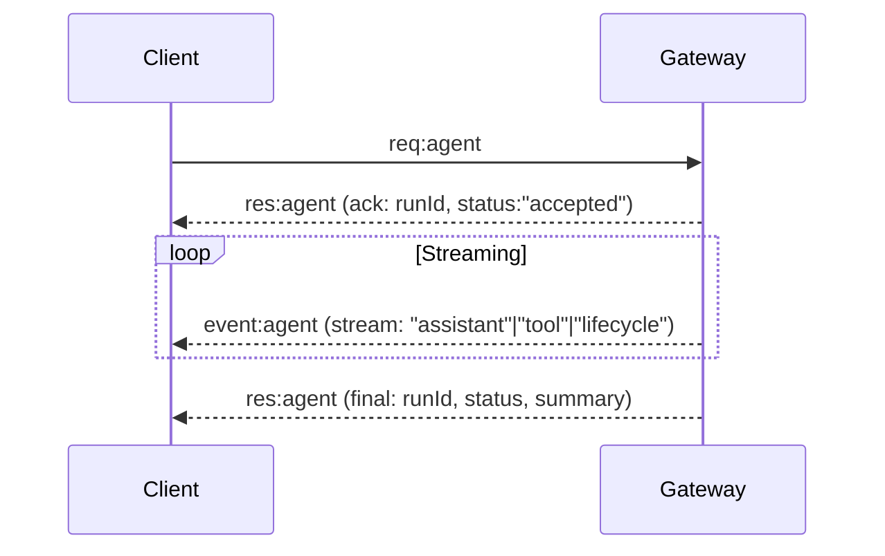

# OpenClaw Deep Dive — Architecture, APIs & Events

**Date:** 2026-02-19  
**Auteur:** Atlas (Subagent Research)

## Résumé Exécutif

- **Gateway centralisé** : Un daemon WebSocket unique gère toutes les connexions (CLI, Web UI, nodes iOS/Android), le routing des messages, et les sessions d'agents
- **Protocol WebSocket typé** : Frames JSON avec handshake obligatoire, requests/responses/events structurés, idempotency keys pour les opérations side-effect
- **Multi-agent isolé** : Chaque agent a son propre workspace, agentDir, et session store — isolation complète des contextes et authentifications
- **Sessions push-based** : Les subagents reportent automatiquement leurs résultats au parent (pas besoin de polling) via le système de sessions
- **Event streaming temps réel** : Events `agent`, `chat`, `presence`, `health`, `heartbeat` émis en continu sur le WebSocket

---

## 1. Architecture Gateway

### Composants principaux

```
┌─────────────────────────────────────────────────────────────┐
│                        GATEWAY                               │
│  ┌──────────────┐  ┌──────────────┐  ┌─────────────────┐   │
│  │   Provider   │  │   WebSocket  │  │   HTTP APIs     │   │
│  │  Connections │  │     RPC      │  │  (OpenAI-compat)│   │
│  │  (WhatsApp,  │  │   Server     │  │                 │   │
│  │   Telegram,  │  │              │  │                 │   │
│  │   Discord)   │  │              │  │                 │   │
│  └──────────────┘  └──────────────┘  └─────────────────┘   │
│         │                 │                   │              │
│  ┌──────────────────────────────────────────────────────┐   │
│  │              Session Manager                          │   │
│  │   - Per-session queuing                              │   │
│  │   - Global queue lane                                │   │
│  │   - Write locks                                      │   │
│  └──────────────────────────────────────────────────────┘   │
│         │                                                    │
│  ┌──────────────────────────────────────────────────────┐   │
│  │              Agent Runtime (Pi-Agent-Core)           │   │
│  │   - Model inference                                  │   │
│  │   - Tool execution                                   │   │
│  │   - Streaming                                        │   │
│  └──────────────────────────────────────────────────────┘   │
└─────────────────────────────────────────────────────────────┘
```

### Runtime Model

- **Un seul processus** : routing, control plane, et connexions channels
- **Port multiplexé** : WebSocket RPC + HTTP APIs + Control UI sur le même port (default `18789`)
- **Bind mode** : `loopback` par défaut (sécurisé)
- **Hot reload** : Config file watching avec modes `off`, `hot`, `restart`, `hybrid`

### Commandes opérationnelles

```bash
# Status et health
openclaw gateway status
openclaw gateway status --deep
openclaw gateway status --json

# Lifecycle
openclaw gateway start
openclaw gateway stop
openclaw gateway restart

# Installation service (launchd/systemd)
openclaw gateway install

# Logs
openclaw logs --follow
```

---

## 2. Protocol WebSocket

### Handshake (connect)

Séquence obligatoire au premier frame :

```json
// Client → Gateway (request)
{
  "type": "req",
  "id": "uuid",
  "method": "connect",
  "params": {
    "minProtocol": 3,
    "maxProtocol": 3,
    "client": {
      "id": "cli",
      "version": "1.2.3",
      "platform": "macos",
      "mode": "operator"
    },
    "role": "operator",
    "scopes": ["operator.read", "operator.write"],
    "auth": { "token": "..." },
    "device": {
      "id": "device_fingerprint",
      "publicKey": "...",
      "signature": "..."
    }
  }
}

// Gateway → Client (response)
{
  "type": "res",
  "id": "uuid",
  "ok": true,
  "payload": {
    "type": "hello-ok",
    "protocol": 3,
    "policy": { "tickIntervalMs": 15000 },
    "presence": {...},
    "health": {...}
  }
}
```

### Framing

| Type | Structure | Usage |
|------|-----------|-------|
| Request | `{type:"req", id, method, params}` | Client → Gateway |
| Response | `{type:"res", id, ok, payload\|error}` | Gateway → Client |
| Event | `{type:"event", event, payload, seq?, stateVersion?}` | Server-push |

### Roles & Scopes

**Roles :**
- `operator` : Control plane client (CLI/UI/automation)
- `node` : Capability host (camera/screen/canvas)

**Scopes (operator) :**
- `operator.read` / `operator.write` / `operator.admin`
- `operator.approvals` / `operator.pairing`

---

## 3. Agent Loop & Events

### Entry Points

- Gateway RPC : `agent` et `agent.wait`
- CLI : `agent` command

### Lifecycle



### Event Streams

| Stream | Description |
|--------|-------------|
| `lifecycle` | `phase: "start" \| "end" \| "error"` |
| `assistant` | Streamed deltas from model |
| `tool` | Tool start/update/end events |

### Queueing & Concurrency

- Runs sérialisés par session key (session lane)
- Optional global lane
- Prevents tool/session races

---

## 4. Multi-Agent Routing

### Concept d'Agent

Un **agent** = une "personnalité" isolée avec :
- **Workspace** : fichiers, AGENTS.md, SOUL.md
- **State directory** (`agentDir`) : auth profiles, model registry
- **Session store** : `~/.openclaw/agents/<agentId>/sessions`

### Paths

```
~/.openclaw/
├── openclaw.json                    # Config
├── workspace/                       # Default workspace
├── workspace-<agentId>/            # Per-agent workspaces
└── agents/
    └── <agentId>/
        ├── agent/                   # Auth profiles, config
        └── sessions/
            ├── sessions.json        # Session store
            └── <SessionId>.jsonl    # Transcripts
```

### Bindings (routing)

```json5
{
  "agents": {
    "list": [
      { "id": "main", "workspace": "~/.openclaw/workspace-main" },
      { "id": "coding", "workspace": "~/.openclaw/workspace-coding" }
    ]
  },
  "bindings": [
    { "agentId": "main", "match": { "channel": "discord", "accountId": "default" } },
    { "agentId": "coding", "match": { "channel": "discord", "accountId": "coding" } }
  ]
}
```

**Routing deterministic** (most-specific wins) :
1. `peer` match (exact DM/group id)
2. `parentPeer` match
3. `guildId + roles`
4. `guildId`
5. `accountId`
6. channel-level
7. fallback to default agent

---

## 5. Subagents (Communication)

### Spawn

Subagents sont créés via le tool `sessions_spawn` (ou implicitement via le système).

### Communication Pattern

```
┌─────────────────┐
│   Main Agent    │
│  (parent)       │
├─────────────────┤
│ sessions_spawn  │──────────► Subagent 1
│                 │──────────► Subagent 2
└─────────────────┘
         ▲
         │ auto-announce
         │ (push-based)
         │
    ┌────┴────┐
    │ Results │
    └─────────┘
```

**Caractéristiques :**
- Own context window
- Results return to caller (summarized)
- Push-based completion : subagent auto-announce when done
- **No busy-polling needed**

### Session Keys

Format : `agent:<agentId>:subagent:<uuid>`

---

## 6. APIs HTTP

### OpenAI-Compatible API

```bash
curl -X POST http://localhost:18789/v1/chat/completions \
  -H "Authorization: Bearer $TOKEN" \
  -H "Content-Type: application/json" \
  -d '{
    "model": "anthropic/claude-sonnet-4-5",
    "messages": [{"role": "user", "content": "Hello"}]
  }'
```

### Tools Invoke API

```bash
curl -X POST http://localhost:18789/tools/invoke \
  -H "Authorization: Bearer $TOKEN" \
  -H "Content-Type: application/json" \
  -d '{
    "tool": "exec",
    "params": { "command": "ls -la" }
  }'
```

---

## 7. Real-Time Monitoring

### Events disponibles

| Event | Payload | Usage |
|-------|---------|-------|
| `agent` | `{runId, stream, payload}` | Agent run updates |
| `chat` | `{type: "delta"\|"final", ...}` | Chat messages |
| `presence` | `{devices: [...]}` | Device presence |
| `health` | `{status, channels}` | System health |
| `tick` | `{stateVersion}` | Periodic heartbeat |
| `heartbeat` | `{ok, alerts}` | Agent heartbeat results |

### Status Commands

```bash
# Gateway status
openclaw gateway status

# Sessions list
openclaw sessions --json

# Active sessions (last N minutes)
openclaw sessions --active 30

# Gateway RPC call
openclaw gateway call sessions.list --params '{}'
```

### Liveness Probe

```
1. Open WS
2. Send `connect`
3. Expect `hello-ok` with snapshot (presence + health)
```

---

## 8. Recommandations pour MnM

### Pour le POC Web

1. **Connecter au Gateway via WebSocket**
   - Implémenter le handshake `connect`
   - Gérer le protocol version negotiation
   - Stocker le device token pour reconnexions

2. **Streamer les events agent**
   - Subscribe aux events `agent` pour updates temps réel
   - Parser `stream: "assistant"` pour le texte
   - Parser `stream: "tool"` pour les tool calls
   - Parser `stream: "lifecycle"` pour start/end/error

3. **Utiliser `agent.wait` pour le sync**
   - Attendre la completion d'un run
   - Timeout configurable (default 30s)

4. **Multi-agent UI**
   - List agents via config ou API
   - Show per-agent sessions
   - Route based on bindings

### Schema Events (exemple)

```typescript
interface AgentEvent {
  type: "event";
  event: "agent";
  payload: {
    runId: string;
    stream: "assistant" | "tool" | "lifecycle";
    phase?: "start" | "end" | "error";
    content?: string;
    toolName?: string;
    toolParams?: any;
    error?: string;
  };
  seq?: number;
  stateVersion?: number;
}
```

### Endpoints clés

| Endpoint | Method | Usage |
|----------|--------|-------|
| `ws://localhost:18789` | WebSocket | Control plane + events |
| `/v1/chat/completions` | POST | OpenAI-compat chat |
| `/tools/invoke` | POST | Direct tool invocation |
| `/__openclaw__/canvas/` | GET | Canvas UI |

---

## Sources

- `/opt/homebrew/lib/node_modules/openclaw/docs/gateway/index.md`
- `/opt/homebrew/lib/node_modules/openclaw/docs/gateway/protocol.md`
- `/opt/homebrew/lib/node_modules/openclaw/docs/concepts/multi-agent.md`
- `/opt/homebrew/lib/node_modules/openclaw/docs/concepts/session.md`
- `/opt/homebrew/lib/node_modules/openclaw/docs/concepts/agent-loop.md`
- `/opt/homebrew/lib/node_modules/openclaw/docs/concepts/architecture.md`
